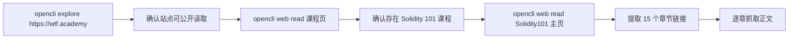
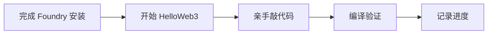
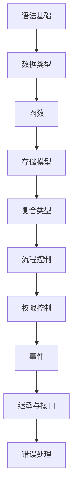
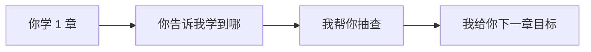

# Solidity101 学习指导

## 说明

这份文档基于我通过 `opencli` 抓取的 `WTF Academy` `Solidity 101` 课程页和 15 个章节页整理而成。

## 来源与抓取方法

我是按下面这条路径找到 `wtf.academy` 并定位到 `Solidity101` 的：

我实际做的事情：

| 步骤 | 做法 |
|---|---|
| 1 | 用 `opencli explore https://wtf.academy` 确认站点可访问、可抓取 |
| 2 | 用 `opencli web read` 抓取首页和课程页 |
| 3 | 直接访问 `https://www.wtf.academy/en/course/solidity101` 确认课程存在 |
| 4 | 从 `Solidity101` 主页提取出 15 个章节名 |
| 5 | 用 `opencli web read` 逐章抓取 15 个章节页 |
| 6 | 根据课程主页 + 章节正文整理出本学习文档 |

课程主页：
- `https://www.wtf.academy/en/course/solidity101`

课程信息：

| 项目 | 内容 |
|---|---|
| 课程名 | `Solidity 101` |
| 难度 | `easy` |
| 预计时长 | `290 minutes` |
| 章节数 | `15` |
| 课程定位 | Solidity 入门 |
| 最近更新时间 | `Jan 10, 2025` |

---

## 当前学习状态

| 项目 | 状态 |
|---|---|
| 学习方式 | 本地环境学习，不使用 `Remix` |
| Solidity 工具链 | `Foundry` 已安装 |
| 当前阶段 | 准备进入第 `1` 章 `HelloWeb3` |
| 监督方式 | 每完成一步就记录到文档 |

当前本地环境确认结果：

| 命令 | 结果 |
|---|---|
| `forge --version` | `forge 1.5.1-stable` |

学习推进流程：

---

## 整体学习路线

```mermaid
flowchart LR
A[HelloWeb3] --> B[值类型]
B --> C[函数]
C --> D[返回值]
D --> E[数据存储]
E --> F[数组与结构体]
F --> G[Mapping]
G --> H[初始值]
H --> I[Constant/Immutable]
I --> J[控制流]
J --> K[构造函数和 modifier]
K --> L[Events]
L --> M[继承]
M --> N[抽象合约和接口]
N --> O[错误处理]
```

---

## 15 章目录

| 章节 | 标题 | 核心主题 |
|---|---|---|
| 1 | HelloWeb3 (Solidity in 3 lines) | 第一份合约、Remix、编译部署 |
| 2 | Value Types | `bool`、`int`、`uint`、地址等 |
| 3 | Function | 函数定义、可见性、行为 |
| 4 | Function Output (return/returns) | `return` / `returns` / 解构赋值 |
| 5 | Data Storage and Scope | `storage` / `memory` / `calldata` |
| 6 | Array & Struct | 数组和结构体 |
| 7 | Mapping | 映射表 |
| 8 | Initial Value | 默认值、`delete` |
| 9 | Constant and Immutable | 常量与不可变变量 |
| 10 | Control Flow | `if/for/while/do-while` |
| 11 | constructor and modifier | 初始化和权限控制 |
| 12 | Events | 事件、日志、前端监听 |
| 13 | Inheritance | 合约继承 |
| 14 | Abstract and Interface | 抽象合约、接口、ERC721 接口 |
| 15 | Errors | `error` / `require` / `assert` |

---

## 每一章学什么

### 1. HelloWeb3

学习目标：
- 知道 Solidity 是什么
- 会在本地用 `Foundry` 创建、编译第一个合约
- 看懂一份最小合约的结构

课程要点：
- `// SPDX-License-Identifier: MIT`
- `pragma solidity ^0.8.21;`
- `contract HelloWeb3`
- `string public _string = "Hello Web3!";`

你学完应该会：
- 解释一份 Solidity 文件为什么要写 license 和 pragma
- 用 `Foundry` 把第一个合约编译通过

---

### 2. Value Types

学习目标：
- 区分 `值类型`、`引用类型`、`mapping`
- 掌握常见基础类型

课程要点：
- `bool`
- `int` / `uint` / `uint256`
- 布尔运算
- 整数和基础运算

你学完应该会：
- 自己声明几个常用状态变量
- 读懂合约里最基础的数据定义

---

### 3. Function

学习目标：
- 理解 Solidity 函数的定义方式
- 对函数输入、输出、可见性建立基础概念

课程重点：
- 函数声明
- 参数
- `public` / `private` / `internal` / `external`

你学完应该会：
- 写一个最基础的读函数和改状态函数

说明：
- 这一页通过 `opencli` 提取到的正文偏少，但课程目录能确认它是函数基础章节。

---

### 4. Function Output

学习目标：
- 理解 `return` 和 `returns`
- 学会多返回值和解构赋值

课程要点：
- `returns(...)`
- `return(...)`
- 命名返回值
- 解构赋值

你学完应该会：
- 写返回多个值的函数
- 接住函数返回值的部分结果

---

### 5. Data Storage and Scope

学习目标：
- 理解 Solidity 最关键的存储模型
- 分清 `storage`、`memory`、`calldata`

课程要点：
- `storage` 存链上，成本高
- `memory` 临时内存，函数内部常用
- `calldata` 常用于不可修改的外部函数参数
- 赋值时是“引用”还是“拷贝”

你学完应该会：
- 判断一个变量应该放哪种数据位置
- 避免因为引用/拷贝搞错数据修改行为

---

### 6. Array & Struct

学习目标：
- 理解数组和结构体这两种最常见的复合数据结构

课程重点：
- 定长数组 / 动态数组
- `struct`
- 如何组织更复杂的数据

你学完应该会：
- 用结构体表示一条记录
- 用数组保存多条记录

说明：
- 这页提取到的正文偏少，但章节位置明确，属于引用类型基础部分。

---

### 7. Mapping

学习目标：
- 理解 Solidity 里的键值存储
- 知道为什么很多链上权限、余额、拥有者关系都用 `mapping`

课程重点：
- `mapping(key => value)`
- 默认值行为
- 常见用途：余额、授权、拥有者

你学完应该会：
- 写一个地址到账户余额的简单映射

说明：
- 这页通过 `opencli` 抓取到的正文较少，但课程目录和章节标题明确。

---

### 8. Initial Value

学习目标：
- 了解变量没赋值时的默认值
- 学会 `delete`

课程要点：
- `bool` 默认 `false`
- `string` 默认空字符串
- `int/uint` 默认 `0`
- `address` 默认零地址
- 数组、结构体、映射的默认值
- `delete a`

你学完应该会：
- 判断未初始化变量的值
- 用 `delete` 重置变量

---

### 9. Constant and Immutable

学习目标：
- 区分 `constant` 和 `immutable`
- 知道它们为什么适合做配置和部署时确定的变量

课程要点：
- `constant` 声明时必须初始化
- `immutable` 可以在构造函数里初始化
- 初始化后都不能再改

你学完应该会：
- 正确使用常量和部署期不可变变量

---

### 10. Control Flow

学习目标：
- 掌握 Solidity 的流程控制语法
- 理解循环和条件判断在链上代码里的使用方式

课程要点：
- `if-else`
- `for`
- `while`
- `do-while`
- 插入排序示例

你学完应该会：
- 写带条件和循环的简单逻辑
- 知道循环过大可能带来 gas 问题

---

### 11. constructor and modifier

学习目标：
- 学会合约初始化
- 学会最基础的权限控制

课程要点：
- `constructor`
- `owner = msg.sender`
- `modifier onlyOwner`
- 用 `require` 做访问控制

你学完应该会：
- 写一个只能 owner 调用的函数

---

### 12. Events

学习目标：
- 理解事件是给前端和链下系统消费的日志
- 知道事件为什么比直接存储更省 gas

课程要点：
- `event Transfer(...)`
- `emit Transfer(...)`
- `topics`
- `data`
- 前端通过 RPC / ethers 监听事件

你学完应该会：
- 在转账或状态更新时发事件
- 理解前端订阅事件的意义

---

### 13. Inheritance

学习目标：
- 理解合约如何复用父合约逻辑

课程重点：
- 继承关系
- 父子合约
- 代码复用

你学完应该会：
- 看懂简单的 `is` 继承写法

说明：
- 这页通过 `opencli` 提取到的正文较少，但它在课程结构中位于 `Events` 之后、`Interface` 之前，属于面向对象组织合约的基础章节。

---

### 14. Abstract and Interface

学习目标：
- 区分抽象合约和接口
- 知道接口为什么是 Dapp 交互的关键

课程要点：
- `abstract contract`
- `interface`
- 接口不能有状态变量和构造函数
- `IERC721` 示例
- `ABI` 和接口的关系

你学完应该会：
- 看懂 ERC20/ERC721 这类标准接口
- 明白合约间如何按接口交互

---

### 15. Errors

学习目标：
- 学会 Solidity 三种主流报错方式
- 知道实际开发里什么时候用哪一种

课程要点：
- `error` + `revert`
- `require(condition, "message")`
- `assert(condition)`

你学完应该会：
- 对用户输入和权限检查使用 `require` 或自定义 `error`
- 知道 `assert` 更偏向内部断言和调试

---

## 学习顺序建议

建议分 4 轮学：

| 轮次 | 章节 | 学习目标 |
|---|---|---|
| 第 1 轮 | 1-4 | 先把语法和函数打牢 |
| 第 2 轮 | 5-9 | 把存储、数据结构、默认值搞清楚 |
| 第 3 轮 | 10-12 | 掌握控制流、权限控制、事件 |
| 第 4 轮 | 13-15 | 补上继承、接口、错误处理 |

---

## 和你作业的关系

虽然你的作业是前端转账页面，但学 `Solidity101` 仍然很有用，因为它能帮你理解：

| Solidity101 内容 | 对你的作业帮助 |
|---|---|
| Value Types | 理解地址、数值、布尔状态 |
| Function / Return | 看懂链上接口和返回值 |
| Events | 理解为什么很多 Dapp 会监听链上事件 |
| Interface | 看懂 ERC20 / 钱包交互 ABI |
| Errors | 看懂失败原因和报错模式 |

---

## 现在该怎么学

你的第一轮目标：

1. 学完 `HelloWeb3`
2. 学完 `Value Types`
3. 学完 `Function`
4. 学完 `Function Output`

第一轮学完的验收标准：

- 你能自己解释最小 Solidity 合约结构
- 你能写基础状态变量
- 你能写一个有参数、有返回值的函数
- 你能说清 `return` 和 `returns` 的区别

---

## 我接下来怎么监督你

我之后会按这个方式陪你：

| 你做什么 | 我做什么 |
|---|---|
| 看一章教程 | 我帮你提炼重点 |
| 看不懂概念 | 我给你翻成人话 |
| 想做练习 | 我给你出小题 |
| 想进入作业开发 | 我帮你把知识接到 React + 钱包项目上 |

---

## 现在开始

现在先学第 `1` 章：`HelloWeb3`。

你学完后直接告诉我：

`我学完 Solidity101 第1章了`

我就继续抽查你，并带你进第 `2` 章。
