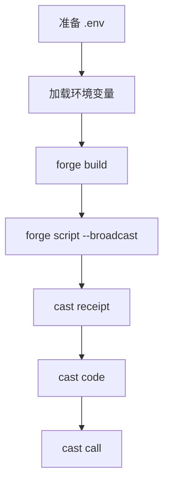

好，后面我按“我出命令，你复制执行”的方式来。  
这一轮我把刚才那次部署和验证用到的命令，整理成一套可直接复制的清单。



**一、准备 `.env`**
先复制模板：

```bash
cp .env.example .env
```

然后你手动编辑 `.env`，填这两项：

```bash
PRIVATE_KEY=你的测试钱包私钥
ALCHEMY_SEPOLIA_URL=https://eth-sepolia.g.alchemy.com/v2/你的API_KEY
```

**二、部署命令**
先加载环境变量：

```bash
source .env
```

编译项目：

```bash
forge build
```

把 `HelloWeb3` 部署到 `Sepolia`：

```bash
forge script script/Counter.s.sol:CounterScript \
  --rpc-url "$ALCHEMY_SEPOLIA_URL" \
  --private-key "$PRIVATE_KEY" \
  --broadcast \
  -vvvv
```

**三、这次部署出来的结果**
| 项目 | 值 |
|---|---|
| 合约地址 | `0xa8C6768a5514323e109f6024C1632265C40e0a38` |
| 交易哈希 | `0x08eec0e1e4231b6ea30851b9c2936b20c1e955a11c308bd2ab1b5f07af33e034` |

**四、验证命令**
1. 查部署交易回执：

```bash
cast receipt 0x08eec0e1e4231b6ea30851b9c2936b20c1e955a11c308bd2ab1b5f07af33e034 \
  --rpc-url "$ALCHEMY_SEPOLIA_URL"
```

2. 查这个地址上有没有合约代码：

```bash
cast code 0xa8C6768a5514323e109f6024C1632265C40e0a38 \
  --rpc-url "$ALCHEMY_SEPOLIA_URL"
```

3. 调用合约，读取 `_string()`：

```bash
cast call 0xa8C6768a5514323e109f6024C1632265C40e0a38 \
  "_string()(string)" \
  --rpc-url "$ALCHEMY_SEPOLIA_URL"
```

**五、你应该看到什么**
| 命令 | 预期结果 |
|---|---|
| `cast receipt` | `status 1 (success)` |
| `cast code` | 返回一长串 bytecode |
| `cast call` | 返回 `"Hello Web3!"` |

**六、如果你想补一个“确认当前链”的命令**
```bash
cast rpc eth_chainId --rpc-url "$ALCHEMY_SEPOLIA_URL"
```

预期会看到类似：
```text
"0xaa36a7"
```

这就是十六进制的 `11155111`，也就是 `Sepolia`。

**给你一个最短顺序版**
```bash
source .env
forge build

forge script script/Counter.s.sol:CounterScript \
  --rpc-url "$ALCHEMY_SEPOLIA_URL" \
  --private-key "$PRIVATE_KEY" \
  --broadcast \
  -vvvv

cast receipt 0x08eec0e1e4231b6ea30851b9c2936b20c1e955a11c308bd2ab1b5f07af33e034 \
  --rpc-url "$ALCHEMY_SEPOLIA_URL"

cast code 0xa8C6768a5514323e109f6024C1632265C40e0a38 \
  --rpc-url "$ALCHEMY_SEPOLIA_URL"

cast call 0xa8C6768a5514323e109f6024C1632265C40e0a38 \
  "_string()(string)" \
  --rpc-url "$ALCHEMY_SEPOLIA_URL"
```

如果你愿意，我下一轮可以继续按这个模式，直接给你：
**“把 MessageBoard 部署到 Sepolia 的完整命令行清单”**。

---

## 七、常见错误：在 `frontend/` 目录里执行 `cast` 导致报错

### 错误现象

我在 `frontend/` 目录里执行下面这类命令时：

```bash
source .env
cast receipt 交易哈希 --rpc-url "$ALCHEMY_SEPOLIA_URL"
```

可能会看到类似报错：

```text
Error: Internal transport error: path must be shorter than SUN_LEN ...
```

### 根本原因

这个错误通常不是交易本身有问题，而是：

- 当前目录在 `frontend/`
- `source .env` 读到的是 `frontend/.env`
- 这个文件里通常只有前端变量，比如：
  - `VITE_SEPOLIA_RPC_URL`
  - `VITE_MESSAGEBOARD_ADDRESS`
- 但没有：
  - `ALCHEMY_SEPOLIA_URL`

于是：

- `cast` 没拿到真正的 `--rpc-url`
- 它会退回去尝试默认的本地 IPC
- 然后因为当前路径太长，触发 `SUN_LEN` 报错

### 正确做法

#### 做法 1：回到项目根目录执行

```bash
cd /Users/vincenthuang/web3-about/走进区块链的世界1-2/wtf-academy-学习指导/hello-web3
source .env
cast receipt 交易哈希 --rpc-url "$ALCHEMY_SEPOLIA_URL"
```

#### 做法 2：如果你还在 `frontend/` 目录

那就显式读取上一级 `.env`：

```bash
source ../.env
cast receipt 交易哈希 --rpc-url "$ALCHEMY_SEPOLIA_URL"
```

### 怎么先自检

在执行 `cast` 前，先确认变量有没有读到：

```bash
echo $ALCHEMY_SEPOLIA_URL
```

如果正常，应该能看到类似：

```text
https://eth-sepolia.g.alchemy.com/v2/xxxx
```

如果输出为空，说明你读错 `.env` 了。

### 经验总结

| 文件 | 用途 |
|---|---|
| 项目根目录 `.env` | 给 `forge` / `cast` / 部署命令用 |
| `frontend/.env` | 给 `Vite` 前端页面用 |

不要把这两个文件混为一谈。
