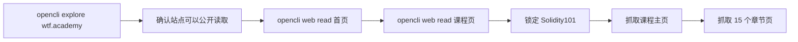
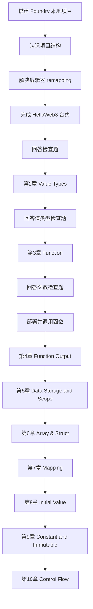

# 交接记录

## 当前进度

```mermaid
flowchart LR
A[已创建学习文件夹] --> B[已生成 Solidity101 学习指导]
B --> C[已抓取 Solidity101 课程主页]
C --> D[已抓取 15 个章节页]
D --> E[已安装 Foundry]
E --> F[已初始化 hello-web3 项目]
F --> G[已解决 remapping 警告]
G --> H[已完成 HelloWeb3 第一个合约]
H --> I[已通过 forge build]
I --> J[已通过 HelloWeb3 检查题]
J --> K[已完成 ValueTypes 合约]
K --> L[已通过 build 且无警告]
L --> M[已完成 ValueTypes 检查题]
M --> N[已完成 FunctionsDemo 合约]
N --> O[已通过 Function build]
O --> P[已完成函数部署与调用]
P --> Q[已完成 Function Output]
Q --> R[已完成 Data Storage and Scope]
R --> S[已完成 Array & Struct]
S --> T[已完成 Mapping]
T --> U[已完成 Initial Value]
U --> V[已完成 Constant and Immutable]
```



## 已完成内容

| 项目 | 状态 |
|---|---|
| 学习文件夹创建 | 已完成 |
| `README.md` 学习指导 | 已完成 |
| `Solidity101` 课程结构整理 | 已完成 |
| 每章学习目标整理 | 已完成 |
| `Foundry` 本地环境安装 | 已完成 |
| `hello-web3` 项目初始化 | 已完成 |
| `remappings.txt` 生成 | 已完成 |
| 第一个 `HelloWeb3` 合约 | 已完成 |
| 第一次 `forge build` | 已通过 |
| `HelloWeb3` 检查题 | 已通过 |
| `ValueTypes` 合约 | 已完成 |
| 第 2 章首次编译 | 已通过且无警告 |
| `ValueTypes` 检查题 | 已完成，整体通过 |
| `FunctionsDemo` 合约 | 已完成 |
| 第 3 章首次编译 | 已通过 |
| 第 3 章检查题 | 已完成，待进入函数调用实操 |
| 第 3 章函数调用实操 | 已完成 |
| 本地链常用命令笔记 | 已补充到 `学习笔记.md` |
| 单仓库改造 | 已完成 |
| ABI / cast 签名笔记 | 已补充到 `学习笔记.md` |
| 第 4 章 Function Output | 已完成 |
| 第 5 章 Data Storage and Scope | 已完成 |
| 第 6 章 Array & Struct | 已完成 |
| 第 7 章 Mapping | 已完成 |
| 第 8 章 Initial Value | 已完成 |
| 第 9 章 Constant and Immutable | 已完成 |

## 本次新增进度

| 项目 | 结果 |
|---|---|
| 学习方式确认 | 不使用 `Remix`，改为本地学习 |
| 工具选择 | 选择 `Foundry` |
| 环境状态 | `forge` 已可用 |
| 当前版本 | `forge 1.5.1-stable` |
| 本地项目 | `hello-web3` 已初始化 |
| 编辑器导入警告 | 已通过 `remappings.txt` 解决 |
| 工作区兼容配置 | 已新增 `.vscode/settings.json` |
| 第 1 章进度 | 已完成第一个最小合约并编译通过 |
| 第 1 章状态 | 已通过，可进入第 2 章 |
| 第 2 章进度 | 已完成值类型合约并编译通过 |
| 第 2 章状态 | 已基本通过，可进入第 3 章 |
| 第 3 章进度 | 已完成函数练习合约并编译通过 |
| 第 3 章当前重点 | 进入“部署并调用函数”实操 |
| 第 3 章状态 | 已完成函数部署调用闭环 |
| 当前工具主线 | `Foundry` |
| `Hardhat` 状态 | 暂未开始，后续需与 `Foundry` 分开记录 |
| Git 结构 | 已从嵌套仓库改为外层单仓库统一管理 |
| 第 4 章状态 | 已完成返回值、tuple、解构赋值和 cast 验证 |
| 第 5 章状态 | 已完成 storage/memory/calldata 和 cast 验证 |
| 第 6 章状态 | 已完成数组、结构体、部署与 cast 验证 |
| 第 6 章易错点 | 已记录：状态变量默认在 `storage`，不是因为 `public` 才上链 |
| 第 7 章状态 | 已完成 mapping、默认值、部署与 cast 验证 |
| 第 7 章疑问 | 已记录：默认值是否有业务意义，取决于 value 类型和业务语义 |
| 第 8 章状态 | 已完成基础类型、数组、结构体默认值与 `delete` 练习 |
| 第 8 章易错点 | 已记录：`delete` 是重置默认值；`mapping` 不能整体 `delete` |
| 第 9 章状态 | 已完成 `constant`、`immutable`、部署与 cast 验证 |
| 第 9 章易错点 | 已记录：`public` 是可见性；`constant/immutable` 是可变性 |

本次完成流程：

```mermaid
flowchart LR
A[确认不用 Remix] --> B[安装 foundryup]
B --> C[执行 foundryup]
C --> D[安装 forge]
D --> E[验证 forge --version]
E --> F[forge init hello-web3]
F --> G[forge remappings > remappings.txt]
G --> H[补充 .vscode/settings.json]
H --> I[修改 HelloWeb3 合约]
I --> J[forge build]
J --> K[回答 HelloWeb3 检查题]
K --> L[编写 ValueTypes 合约]
L --> M[清理警告并重新编译]
M --> N[回答 ValueTypes 检查题]
N --> O[编写 FunctionsDemo 合约]
O --> P[forge build]
P --> Q[anvil + cast 调用函数]
Q --> R[hello-web3 改为单仓库结构]
R --> S[完成第4章 Function Output]
S --> T[完成第5章 Data Storage and Scope]
T --> U[完成第6章 Array & Struct]
U --> V[完成第7章 Mapping]
V --> W[完成第8章 Initial Value]
W --> X[完成第9章 Constant and Immutable]
```



## 我是怎么通过 opencli 找到 WTF Academy 的



具体过程：

| 步骤 | 说明 |
|---|---|
| 1 | 先用 `opencli explore https://wtf.academy` 探测站点，确认它可以被公开读取 |
| 2 | 再用 `opencli web read --url https://wtf.academy` 抓首页 |
| 3 | 再用 `opencli web read --url https://www.wtf.academy/en/course` 抓课程页 |
| 4 | 然后直接验证 `https://www.wtf.academy/en/course/solidity101` 这门课程存在 |
| 5 | 抓取 `Solidity101` 主页，提取出 15 个章节链接 |
| 6 | 再逐章抓取 `HelloWeb3` 到 `Errors` 的章节正文 |
| 7 | 最后把课程主页和章节内容整理成 `README.md` |

## 当前文件

| 文件 | 用途 |
|---|---|
| `README.md` | Solidity101 学习指导主文档 |
| `交接记录.md` | 给 VS Code Codex 插件继续接力用 |

## 下一步学习任务

1. 进入第 `10` 章 `Control Flow`。
2. 编写最小 `if` / `for` 练习。
3. 理解链上循环和条件判断的基本用法。

## 在 VS Code Codex 插件中可直接使用的提示词

```text
请读取当前目录下 wtf-academy-学习指导/README.md 和 wtf-academy-学习指导/交接记录.md。
我们继续学习 WTF Academy 的 Solidity101。
我现在要从第1章 HelloWeb3 开始，请你像老师一样监督我学习：
1. 先用简洁的话讲这一章重点
2. 再出 3 个检查题
3. 等我回答后再决定是否进入下一章
```

## 目标



现在可以直接从“第 10 章 Control Flow”开始继续。
