# 交接记录

## 当前总判断

当前日期：`2026-04-08`

关键判断：

| 项目 | 结论 |
|---|---|
| 当前基础 | 已完成 `Solidity101` 全部 `15` 章 |
| 当前实操 | 已做过最小 DApp 闭环 |
| 4 月目标 | 不是刷完 `102 + 103`，而是为 `2026-04-25` 的 DES 线下课做定向准备 |
| 最优策略 | 选学 `102/103` 高收益章节 + 补 DES 业务模型 |

当前总路线：

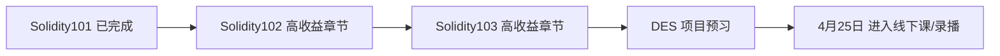

## 4月25日前学习计划

### 第 1 阶段：`4/8 - 4/14`

目标：
- 优先完成 `Solidity102` 的高收益章节。

章节清单：

| 顺序 | 章节 |
|---|---|
| 1 | `Fallback` |
| 2 | `Interact with Contract` |
| 3 | `Call` |
| 4 | `Delegatecall` |
| 5 | `ABI Encoding and Decoding` |
| 6 | `Hash` |
| 7 | `Function Selector` |
| 8 | `Try Catch` |

### 第 2 阶段：`4/15 - 4/20`

目标：
- 优先完成 `Solidity103` 中最贴近 DES 的章节。

章节清单：

| 顺序 | 章节 |
|---|---|
| 1 | `ERC20` |
| 2 | `Digital Signature / EIP712` |
| 3 | `ERC4626` |
| 4 | `Proxy Contract` |
| 5 | `Transparent Proxy` |
| 6 | `UUPS` |
| 7 | `Multisignature Wallet` |

### 第 3 阶段：`4/21 - 4/24`

目标：
- 不再继续铺新课，转入 DES 业务预习和最小模拟实战。

任务清单：

| 顺序 | 任务 |
|---|---|
| 1 | 理解 `Vault / LP / shares` |
| 2 | 理解 `Oracle` 价格来源 |
| 3 | 理解 `Liquidation` 清算流程 |
| 4 | 理解 `Multisig / Timelock / UUPS` 权限结构 |
| 5 | 做 1 个最小 DES 风格合约练习 |

## VS Code 接力要求

后续在 VS Code 中继续学习时，默认遵守以下顺序：

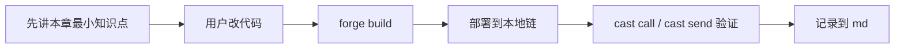

对后续 Codex 的明确要求：
- 不要默认继续完整刷完 `102` 或 `103`。
- 必须优先执行本记录里的高收益章节清单。
- 每完成一个章节，继续同步更新 `学习笔记.md` 和 `交接记录.md`。
- 如果用户时间紧张，优先保留 `102` 的调用类章节和 `103` 的 `ERC20 / EIP712 / ERC4626 / Proxy / UUPS / Multisig`。

## 当前进度


## 已完成内容

| 项目 | 状态 |
|---|---|
| 学习文件夹创建 | 已完成 |
| `README.md` 学习指导 | 已完成 |
| `Solidity101` 课程结构整理 | 已完成 |
| 每章学习目标整理 | 已完成 |
| `Foundry` 本地环境安装 | 已完成 |
| `hello-web3` 项目初始化 | 已完成 |
| `remappings.txt` 生成 | 已完成 |
| 第一个 `HelloWeb3` 合约 | 已完成 |
| 第一次 `forge build` | 已通过 |
| `HelloWeb3` 检查题 | 已通过 |
| `ValueTypes` 合约 | 已完成 |
| 第 2 章首次编译 | 已通过且无警告 |
| `ValueTypes` 检查题 | 已完成，整体通过 |
| `FunctionsDemo` 合约 | 已完成 |
| 第 3 章首次编译 | 已通过 |
| 第 3 章检查题 | 已完成，待进入函数调用实操 |
| 第 3 章函数调用实操 | 已完成 |
| 本地链常用命令笔记 | 已补充到 `学习笔记.md` |
| 单仓库改造 | 已完成 |
| ABI / cast 签名笔记 | 已补充到 `学习笔记.md` |
| 第 4 章 Function Output | 已完成 |
| 第 5 章 Data Storage and Scope | 已完成 |
| 第 6 章 Array & Struct | 已完成 |
| 第 7 章 Mapping | 已完成 |
| 第 8 章 Initial Value | 已完成 |
| 第 9 章 Constant and Immutable | 已完成 |
| 第 10 章 Control Flow | 已完成 |
| 第 11 章 constructor and modifier | 已完成 |
| 第 12 章 Events | 已完成 |
| 第 13 章 Inheritance | 已完成 |
| 第 14 章 Abstract and Interface | 已完成 |
| 第 15 章 Errors | 已完成 |

## 本次新增进度

| 项目 | 结果 |
|---|---|
| 学习方式确认 | 不使用 `Remix`，改为本地学习 |
| 工具选择 | 选择 `Foundry` |
| 环境状态 | `forge` 已可用 |
| 当前版本 | `forge 1.5.1-stable` |
| 本地项目 | `hello-web3` 已初始化 |
| 编辑器导入警告 | 已通过 `remappings.txt` 解决 |
| 工作区兼容配置 | 已新增 `.vscode/settings.json` |
| 第 1 章进度 | 已完成第一个最小合约并编译通过 |
| 第 1 章状态 | 已通过，可进入第 2 章 |
| 第 2 章进度 | 已完成值类型合约并编译通过 |
| 第 2 章状态 | 已基本通过，可进入第 3 章 |
| 第 3 章进度 | 已完成函数练习合约并编译通过 |
| 第 3 章当前重点 | 进入“部署并调用函数”实操 |
| 第 3 章状态 | 已完成函数部署调用闭环 |
| 当前工具主线 | `Foundry` |
| `Hardhat` 状态 | 暂未开始，后续需与 `Foundry` 分开记录 |
| Git 结构 | 已从嵌套仓库改为外层单仓库统一管理 |
| 第 4 章状态 | 已完成返回值、tuple、解构赋值和 cast 验证 |
| 第 5 章状态 | 已完成 storage/memory/calldata 和 cast 验证 |
| 第 6 章状态 | 已完成数组、结构体、部署与 cast 验证 |
| 第 6 章易错点 | 已记录：状态变量默认在 `storage`，不是因为 `public` 才上链 |
| 第 7 章状态 | 已完成 mapping、默认值、部署与 cast 验证 |
| 第 7 章疑问 | 已记录：默认值是否有业务意义，取决于 value 类型和业务语义 |
| 第 8 章状态 | 已完成基础类型、数组、结构体默认值与 `delete` 练习 |
| 第 8 章易错点 | 已记录：`delete` 是重置默认值；`mapping` 不能整体 `delete` |
| 第 9 章状态 | 已完成 `constant`、`immutable`、部署与 cast 验证 |
| 第 9 章易错点 | 已记录：`public` 是可见性；`constant/immutable` 是可变性 |
| 第 10 章状态 | 已完成 `if/else`、`for`、部署与 cast 验证 |
| 第 10 章易错点 | 已记录：循环结束条件要看继续条件；链上循环要关注 gas |
| 第 11 章状态 | 已完成 `constructor`、`modifier`、权限验证与 cast 实操 |
| 第 11 章易错点 | 已记录：`_` 是执行位置；前导 `_` 只是命名习惯，不是权限关键字 |
| 第 12 章状态 | 已完成 `event`、`emit`、部署与日志验证 |
| 第 12 章疑问 | 已记录：`emit` 容易，难点在前端如何监听和处理链上事件 |
| 第 13 章状态 | 已完成继承、部署与 cast 验证 |
| 第 13 章体感 | 已记录：继承能减少重复逻辑，但会增加源码阅读负担 |
| 第 14 章状态 | 已完成接口、实现合约、部署与 cast 验证 |
| 第 14 章发散问题 | 已记录：接口不提供默认实现；主要用于统一外部调用规则 |
| 第 15 章状态 | 已完成 `require`、`assert`、自定义 `error` 与 cast 验证 |
| 第 15 章易错点 | 已记录：改完源码只 build 不会影响旧合约地址，错误类型变化后必须重新部署 |

本次完成流程：


## 我是怎么通过 opencli 找到 WTF Academy 的

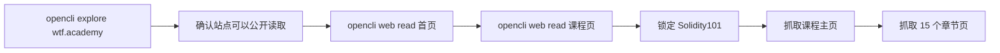

具体过程：

| 步骤 | 说明 |
|---|---|
| 1 | 先用 `opencli explore https://wtf.academy` 探测站点，确认它可以被公开读取 |
| 2 | 再用 `opencli web read --url https://wtf.academy` 抓首页 |
| 3 | 再用 `opencli web read --url https://www.wtf.academy/en/course` 抓课程页 |
| 4 | 然后直接验证 `https://www.wtf.academy/en/course/solidity101` 这门课程存在 |
| 5 | 抓取 `Solidity101` 主页，提取出 15 个章节链接 |
| 6 | 再逐章抓取 `HelloWeb3` 到 `Errors` 的章节正文 |
| 7 | 最后把课程主页和章节内容整理成 `README.md` |

## 当前文件

| 文件 | 用途 |
|---|---|
| `README.md` | Solidity101 学习指导主文档 |
| `交接记录.md` | 给 VS Code Codex 插件继续接力用 |

## 下一步学习任务

1. 已完成 Solidity101 全部 `15` 章。
2. 下一步不是完整刷完 `102 + 103`，而是先进入 `Solidity102` 高收益章节。
3. 第一章从 `Fallback` 开始。
4. 每章继续保持“讲解 -> 改代码 -> build -> 部署 -> cast 验证 -> 检查题 -> 记录”的节奏。

## 在 VS Code Codex 插件中可直接使用的提示词

```text
请读取当前目录下 wtf-academy-学习指导/README.md 和 wtf-academy-学习指导/交接记录.md。
我们继续学习 WTF Academy。
请先读取当前目录下 wtf-academy-学习指导/README.md、学习笔记.md、交接记录.md。
现在不要从 Solidity101 重新开始，而是按交接记录里的冲刺计划推进。
我现在要从 Solidity102 的 Fallback 开始，请你像老师一样监督我学习：
1. 先用简洁的话讲这一章重点
2. 再让我亲手改代码
3. 然后带我 forge build、部署、cast 验证
4. 再出 3 个检查题
5. 通过后更新 md 文档，再决定是否进入下一章
```

## 目标

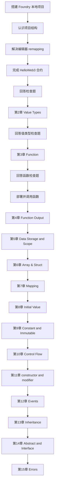

现在已经完成 Solidity101 全部 `15` 章，可以进入 DApp 对接实战。

## DApp 最小实战阶段进度

### 当前进度

```mermaid
flowchart LR
A[Solidity101 15章完成] --> B[进入 DApp 最小实战]
B --> C[编写 MinimalDapp 合约]
C --> D[forge build]
D --> E[部署到 anvil]
E --> F[cast call 读取 count 和 owner]
F --> G[cast send 成功执行 increment]
G --> H[cast send 成功执行 setCount(5)]
H --> I[验证 CountTooSmall(5,3)]
I --> J[验证 NotOwner()]
J --> K[cast logs 查看 CountUpdated]
K --> L[搭建 React + Vite 前端]
L --> M[前端读取 count 和 owner]
M --> N[MetaMask 连接成功]
N --> O[给前端钱包补本地测试 ETH]
O --> P[前端 increment() 交易确认]
P --> Q[anvil 重启后本地链重置]
Q --> R[重新部署 MinimalDapp]
R --> S[给 MetaMask 账户补测试 ETH]
S --> T[前端恢复读取 count 和 owner]
```

### 已完成内容

| 项目 | 状态 |
|---|---|
| DApp 最小合约设计 | 已完成 |
| `MinimalDapp.sol` 编写 | 已完成 |
| `forge build` | 已通过 |
| 本地链 `anvil` 启动 | 已完成 |
| `MinimalDapp` 部署 | 已完成 |
| `count()` / `owner()` 读取 | 已完成 |
| `increment()` 写操作验证 | 已完成 |
| `setCount(5)` 写操作验证 | 已完成 |
| `CountTooSmall(5, 3)` 错误验证 | 已完成 |
| `NotOwner()` 错误验证 | 已完成 |
| `cast logs` 事件日志验证 | 已完成 |
| `MinimalDapp.sol` 学习注释补充 | 已完成 |
| `frontend` 最小页面搭建 | 已完成 |
| 前端读链 | 已完成 |
| MetaMask 自定义网络切换 | 已完成 |
| 前端钱包测试 ETH 补充 | 已完成 |
| 前端 `increment()` 写交易 | 已完成 |
| 本地链重置原因排查 | 已完成 |
| `MinimalDapp` 重新部署恢复 | 已完成 |
| MetaMask 测试 ETH 二次补充 | 已完成 |
| 前端恢复读取 | 已完成 |
| `setCount(5)` 权限失败原因厘清 | 已完成 |
| 前端错误提示收口 | 已完成 |

### 本次新增结论

| 项目 | 结果 |
|---|---|
| 当前工具主线 | 继续使用 `Foundry` |
| 当前实战目标 | 先做最小闭环：钱包连接、读、写、确认、事件、错误 |
| 当前合约 | `hello-web3/src/MinimalDapp.sol` |
| 当前合约地址 | `0x9fE46736679d2D9a65F0992F2272dE9f3c7fa6e0` |
| 当前前端目录 | `hello-web3/frontend` |
| `call` 的定位 | 主动读取当前链上状态 |
| `event` 的定位 | 被动感知链上变化 |
| ABI 的作用 | 不只调函数，也用于解码错误和事件 |
| 当前阶段学习方式 | 命令由用户手动执行，避免我代跑 |
| 前端读链能力 | 已用 `publicClient.readContract` 打通 |
| 前端写链能力 | 已用 MetaMask + `walletClient.writeContract` 打通 |
| 本地链重置结论 | 旧数据不是被篡改，而是已经切到新的 `anvil` 链实例 |
| 当前页面状态 | 当前新链上 `count = 0`，`owner = 0xf39Fd6e51aad88F6F4ce6aB8827279cffFb92266` |
| `setCount(5)` 当前定位 | 用于演示权限失败和错误提示，不是当前成功写入示例 |
| 当前前端收口范围 | 先做 `setCount(5)` 预期提示 + 链上错误翻译 |
| 当前错误处理能力 | 已能区分用户取消、`NotOwner()`、`CountTooSmall(...)` |
| 当前事件监听状态 | 已恢复最小版 `CountUpdated` 监听，并在收到事件后自动刷新 |
| 当前前端验证 | `npm run build` 已通过 |
| 用户取消分支验证 | 已完成；控制台错误链落到 `UserRejectedRequestError` |
| `viem` 错误层级排查 | 已完成；自定义错误应优先从 `ContractFunctionRevertedError.data.errorName` 读取 |
| 事件监听最小版 | 已完成；当前页面同时保留“手动刷新”和“事件触发刷新”两条路径 |
| 事件监听浏览器验证 | 已完成；重启浏览器后可看到“开始监听 / 监听到 CountUpdated 事件”日志 |
| 输入式写交易主线 | 已新增 `increaseBy(step)`，用于避开 owner 限制练前端表单交互 |
| 合约重部署后前端联调 | 已完成；`App.jsx` 地址已同步，网页实测通过 |
| 新练习 `MessageBoard` 起步 | 已完成；合约已创建并通过 `forge build` |
| `MessageBoard` 命令行闭环 | 已完成；已通过 `cast call/send/call` 验证字符串读写 |
| `MessageBoard` 前端接入 | 已完成；`App.jsx` 已切换到留言板页面并通过 `vite build` |
| `MessageBoard` 网页实测 | 已完成；当前 `App.jsx` 可正常读取和写入留言 |
| 前端归档文件 | 已完成；`App.messageboard.jsx` 和 `App.minimaldapp.jsx` 已保存 |
| `MessageBoard` 双层校验 | 已完成；前端拦空输入，合约用 `require(..., "Empty message")` 兜底 |
| `MessageBoard` author 扩展 | 已完成；合约和前端都已支持显示当前留言作者 |
| `MessageBoard` 新地址同步 | 已完成；当前地址为 `0x0165878A594ca255338adfa4d48449f69242Eb8F` |

### 当前文件

| 文件 | 用途 |
|---|---|
| `hello-web3/src/MinimalDapp.sol` | DApp 最小实战主合约 |
| `hello-web3/src/MessageBoard.sol` | 新一轮最小 DApp 练习合约 |
| `hello-web3/frontend/src/App.jsx` | 当前运行中的 MessageBoard 页面 |
| `hello-web3/frontend/src/App.messageboard.jsx` | MessageBoard 版本归档 |
| `hello-web3/frontend/src/App.minimaldapp.jsx` | MinimalDapp 版本归档 |
| `学习笔记.md` | 已补充本节命令、易错点和结论 |
| `交接记录.md` | 已补充当前 DApp 阶段进度 |

### 下一步任务

1. 用户手动重新部署 `MessageBoard` 新版本，并把最新地址同步到 `App.jsx`。
2. 用户验证页面能同时读取 `message` 和 `author`，并在发新留言后自动更新两者。

## Solidity102 第 16 章启动

### 当前进度

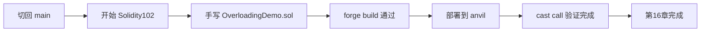

### 已完成内容

| 项目 | 状态 |
|---|---|
| 第 `16` 章起点确认 | 已完成 |
| `hello-web3/src/OverloadingDemo.sol` | 已完成 |
| `forge build` | 已通过 |
| `OverloadingDemo` 本地部署 | 已完成 |
| 当前合约地址 | `0x5FbDB2315678afecb367f032d93F642f64180aa3` |
| `cast call` 验证 | 已完成 |

### 当前文件

| 文件 | 用途 |
|---|---|
| `hello-web3/src/OverloadingDemo.sol` | Solidity102 第 16 章重载练习 |
| `学习笔记.md` | 已补充 Overloading 章节笔记 |
| `交接记录.md` | 已补充当前起步状态 |

### 下一步任务

1. 进入第 `17` 章 `Library`。
2. 手写 `MathLibrary.sol` 和 `LibraryDemo.sol`。
3. 通过 `forge build`、部署、`cast call` 完成闭环。

## Solidity102 第 17 章 Library

### 当前进度

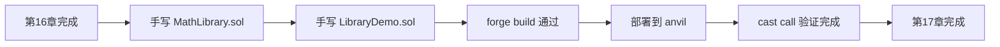

### 已完成内容

| 项目 | 状态 |
|---|---|
| `hello-web3/src/MathLibrary.sol` | 已完成 |
| `hello-web3/src/LibraryDemo.sol` | 已完成 |
| `import {MathLibrary} from "./MathLibrary.sol";` | 已验证 |
| `forge build` | 已通过 |
| `LibraryDemo` 本地部署 | 已完成 |
| 当前合约地址 | `0xe7f1725E7734CE288F8367e1Bb143E90bb3F0512` |
| `cast call getMax(...)` | 已完成 |
| 开源库生态补充 | 已完成 |

### 当前判断

| 问题 | 结论 |
|---|---|
| Solidity 有没有像 lodash 一样的库 | 有 |
| 当前最值得先认识的库 | `OpenZeppelin Contracts` |
| Foundry 能不能像 npm 一样装库 | 能，用 `forge install` |

### 下一步任务

1. 开始第 `18` 章 `Import`。
2. 先比较 `import "./A.sol";` 和 `import {A} from "./A.sol";`。
3. 继续按“讲最小知识点 -> 你手敲 -> `forge build`”推进。

## 4月25日前冲刺线 当前进度

### 当前进度

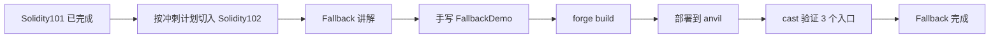

### 已完成内容

| 项目 | 状态 |
|---|---|
| 冲刺路线切换到 `4/25` 前主线 | 已完成 |
| `hello-web3/src/FallbackDemo.sol` | 已完成 |
| `hello-web3/script/FallbackDemo.s.sol` | 已完成 |
| `forge build` | 已通过 |
| `FallbackDemo` 本地部署 | 已完成 |
| 当前合约地址 | `0x5FbDB2315678afecb367f032d93F642f64180aa3` |
| `deposit / receive / fallback` 三路验证 | 已完成 |
| `receive()` 不能读 `msg.data` 这个坑 | 已确认并记录 |
| `cast send` 原始 calldata 写法 | 已确认并记录 |

### 当前判断

| 问题 | 结论 |
|---|---|
| `Fallback` 是否属于高收益章节 | 是，后面学 `Call / Delegatecall / Proxy` 都会用到 |
| 本章最核心收获 | 理清 3 个入口的触发条件 |
| 当前工具路线 | 继续使用 `Foundry` |
| 当前节奏 | 继续按“讲解 -> 改代码 -> build -> 部署 -> cast -> 检查题 -> 更新 md”推进 |

### 当前文件

| 文件 | 用途 |
|---|---|
| `hello-web3/src/FallbackDemo.sol` | `Fallback` 章节练习合约 |
| `hello-web3/script/FallbackDemo.s.sol` | `FallbackDemo` 部署脚本 |
| `学习笔记.md` | 已补充本章命令、易错点和结论 |
| `交接记录.md` | 已补充本章冲刺进度 |

### 下一步任务

1. 进入 `Solidity102` 的 `Interact with Contract`。
2. 学合约 A 调合约 B 的最小闭环。
3. 继续用 `forge build + 部署 + cast` 做调用验证。

## Solidity102 第 19 章 Fallback 手敲闭环

### 当前进度

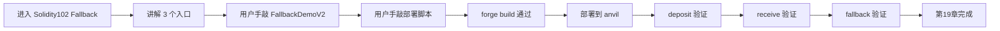

### 已完成内容

| 项目 | 状态 |
|---|---|
| `hello-web3/src/FallbackDemoV2.sol` | 已完成 |
| `hello-web3/script/FallbackDemoV2.s.sol` | 已完成 |
| 用户手动 `forge build` | 已通过 |
| 用户手动部署到本地链 | 已完成 |
| 当前手敲版合约地址 | `0x5FbDB2315678afecb367f032d93F642f64180aa3` |
| `deposit()` 入口验证 | 已完成 |
| `receive()` 入口验证 | 已完成 |
| `fallback()` 入口验证 | 已完成 |
| `wei / ether` 单位问题 | 已讲清 |
| `msg.data` 与 `lastData` 区别 | 已讲清 |

### 当前判断

| 问题 | 结论 |
|---|---|
| 当前学习方式 | 以后默认由用户手动敲代码、手动执行命令 |
| 本章是否通过 | 已通过 |
| 用户当前易混点 | “当次调用的 `msg.data`” 和 “链上当前的 `lastData`” 容易混淆，但本轮已厘清 |
| 下一章最小目标 | `Interact with Contract`：理解合约 A 如何通过地址调用合约 B |

### 当前文件

| 文件 | 用途 |
|---|---|
| `hello-web3/src/FallbackDemo.sol` | Fallback 参考答案版 |
| `hello-web3/script/FallbackDemo.s.sol` | 参考答案版部署脚本 |
| `hello-web3/src/FallbackDemoV2.sol` | 用户手敲练习版 |
| `hello-web3/script/FallbackDemoV2.s.sol` | 用户手敲练习版部署脚本 |
| `学习笔记.md` | 已补充本章手敲结论 |
| `交接记录.md` | 已补充本章完成进度 |

### 下一步任务

1. 开始 `Solidity102` 的 `Interact with Contract`。
2. 继续沿用“讲解 -> 你手敲 -> `forge build` -> 部署 -> `cast` 验证 -> 检查题”的节奏。
3. 先做最小版 `Target + Caller` 两合约调用闭环。

## Solidity102 第 20 章 Interact with Contract

### 当前进度

```mermaid
flowchart LR
A[Fallback 完成] --> B[手敲 TargetDemo]
B --> C[手敲 CallerDemo]
C --> D[手敲部署脚本]
D --> E[forge build 通过]
E --> F[部署 TargetDemo 和 CallerDemo]
F --> G[初始读取验证]
G --> H[调用 CallerDemo.callSetNumber(7)]
H --> I[二次读取验证]
I --> J[第20章完成]
```

### 已完成内容

| 项目 | 状态 |
|---|---|
| `hello-web3/src/TargetDemo.sol` | 已完成 |
| `hello-web3/src/CallerDemo.sol` | 已完成 |
| `hello-web3/script/InteractDemo.s.sol` | 已完成 |
| 用户手动 `forge build` | 已通过 |
| 用户手动部署到本地链 | 已完成 |
| `TargetDemo` 地址 | `0x5FbDB2315678afecb367f032d93F642f64180aa3` |
| `CallerDemo` 地址 | `0xe7f1725E7734CE288F8367e1Bb143E90bb3F0512` |
| 初始读取 `0 / 0` | 已完成 |
| 跨合约写入 `callSetNumber(7)` | 已完成 |
| 二次读取 `7 / 7` | 已完成 |

### 当前判断

| 问题 | 结论 |
|---|---|
| 本章是否通过 | 已通过 |
| 用户当前学习方式 | 继续保持“我讲解，用户手敲、手跑命令” |
| 本章最关键理解 | 目标地址决定“调谁”，函数选择器决定“调哪个函数” |
| 用户已厘清 | `TargetDemo(targetAddress)` 不是重新部署，而是地址类型转换 |

### 当前文件

| 文件 | 用途 |
|---|---|
| `hello-web3/src/TargetDemo.sol` | 被调用方合约 |
| `hello-web3/src/CallerDemo.sol` | 调用方合约 |
| `hello-web3/script/InteractDemo.s.sol` | 本章部署脚本 |
| `学习笔记.md` | 已补充本章命令与结论 |
| `交接记录.md` | 已补充本章完成进度 |

### 下一步任务

1. 进入 `Solidity102` 的 `Call`。
2. 学低级调用和返回值布尔结果。
3. 继续按“讲解 -> 手敲 -> build -> 部署 -> cast -> 检查题”的顺序推进。

## Solidity102 第 21 章 Call

### 当前进度

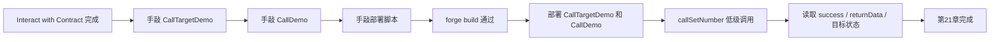

### 已完成内容

| 项目 | 状态 |
|---|---|
| `hello-web3/src/CallTargetDemo.sol` | 已完成 |
| `hello-web3/src/CallDemo.sol` | 已完成 |
| `hello-web3/script/CallDemo.s.sol` | 已完成 |
| 用户手动 `forge build` | 已通过 |
| 用户手动部署到本地链 | 已完成 |
| `CallTargetDemo` 地址 | `0xCf7Ed3AccA5a467e9e704C703E8D87F634fB0Fc9` |
| `CallDemo` 地址 | `0xDc64a140Aa3E981100a9becA4E685f962f0cF6C9` |
| 低级 `call` 写入验证 | 已完成 |
| `success / returnData / value` | 已讲清 |

### 当前判断

| 问题 | 结论 |
|---|---|
| 本章是否通过 | 已通过 |
| 本章最关键理解 | `call` 是“地址 + calldata”的低级调用 |
| 用户已厘清 | `returnData` 是原始 ABI bytes，不是自动解码后的值 |

## Solidity102 第 22 章 Delegatecall

### 当前进度

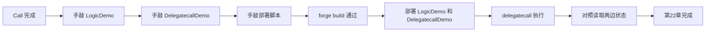

### 已完成内容

| 项目 | 状态 |
|---|---|
| `hello-web3/src/LogicDemo.sol` | 已完成 |
| `hello-web3/src/DelegatecallDemo.sol` | 已完成 |
| `hello-web3/script/DelegatecallDemo.s.sol` | 已完成 |
| 用户手动 `forge build` | 已通过 |
| 用户手动部署到本地链 | 已完成 |
| `DelegatecallDemo` 地址 | `0xCf7Ed3AccA5a467e9e704C703E8D87F634fB0Fc9` |
| `LogicDemo` 地址 | `0x9fE46736679d2D9a65F0992F2272dE9f3c7fa6e0` |
| `delegatecall` 验证 | 已完成 |
| storage slot 对齐问题 | 已讲清 |

### 当前判断

| 问题 | 结论 |
|---|---|
| 本章是否通过 | 已通过 |
| 本章最关键理解 | 借用别人的代码，修改自己的 storage |
| 当前高风险点 | storage layout / slot 顺序是实际工程里的高风险点 |

## Solidity102 第 23 章 ABI Encoding and Decoding

### 当前进度

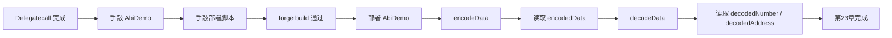

### 已完成内容

| 项目 | 状态 |
|---|---|
| `hello-web3/src/AbiDemo.sol` | 已完成 |
| `hello-web3/script/AbiDemo.s.sol` | 已完成 |
| 用户手动 `forge build` | 已通过 |
| 用户手动部署到本地链 | 已完成 |
| `AbiDemo` 地址 | `0x5FC8d32690cc91D4c39d9d3abcBD16989F875707` |
| `encode -> decode` 闭环 | 已完成 |
| 外层 bytes 包装和内层真实编码 | 已讲清 |

### 当前判断

| 问题 | 结论 |
|---|---|
| 本章是否通过 | 已通过 |
| 本章最关键理解 | `encode` 得到 bytes，`decode` 时类型和顺序必须一致 |
| 用户已厘清 | 函数调用本身的 calldata 不等于 `abi.encode(...)` 生成的数据 |

### 下一步任务

1. 进入 `Solidity102` 的 `Hash`。
2. 学 `keccak256` 和最小哈希验证。
3. 继续按“讲解 -> 手敲 -> build -> 部署 -> cast -> 检查题”的顺序推进。
