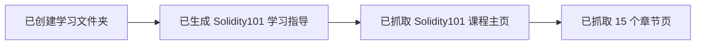
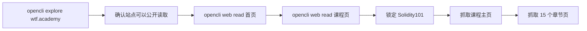
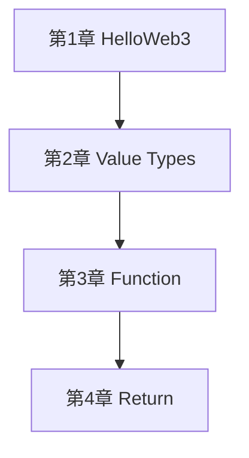

# 交接记录

## 当前进度



## 已完成内容

| 项目 | 状态 |
|---|---|
| 学习文件夹创建 | 已完成 |
| `README.md` 学习指导 | 已完成 |
| `Solidity101` 课程结构整理 | 已完成 |
| 每章学习目标整理 | 已完成 |

## 我是怎么通过 opencli 找到 WTF Academy 的



具体过程：

| 步骤 | 说明 |
|---|---|
| 1 | 先用 `opencli explore https://wtf.academy` 探测站点，确认它可以被公开读取 |
| 2 | 再用 `opencli web read --url https://wtf.academy` 抓首页 |
| 3 | 再用 `opencli web read --url https://www.wtf.academy/en/course` 抓课程页 |
| 4 | 然后直接验证 `https://www.wtf.academy/en/course/solidity101` 这门课程存在 |
| 5 | 抓取 `Solidity101` 主页，提取出 15 个章节链接 |
| 6 | 再逐章抓取 `HelloWeb3` 到 `Errors` 的章节正文 |
| 7 | 最后把课程主页和章节内容整理成 `README.md` |

## 当前文件

| 文件 | 用途 |
|---|---|
| `README.md` | Solidity101 学习指导主文档 |
| `交接记录.md` | 给 VS Code Codex 插件继续接力用 |

## 下一步学习任务

1. 从 `Solidity101` 第 `1` 章 `HelloWeb3` 开始。
2. 学完后先回答这 3 个问题：
   - `SPDX-License-Identifier` 是干什么的？
   - `pragma solidity ^0.8.21;` 表示什么？
   - `string public _string = "Hello Web3!";` 这里的 `public` 有什么作用？
3. 再进入第 `2` 章 `Value Types`。

## 在 VS Code Codex 插件中可直接使用的提示词

```text
请读取当前目录下 wtf-academy-学习指导/README.md 和 wtf-academy-学习指导/交接记录.md。
我们继续学习 WTF Academy 的 Solidity101。
我现在要从第1章 HelloWeb3 开始，请你像老师一样监督我学习：
1. 先用简洁的话讲这一章重点
2. 再出 3 个检查题
3. 等我回答后再决定是否进入下一章
```

## 目标



切换到 VS Code 后，从第 `1` 章开始继续即可。
