# 交接记录

## 当前总判断

当前日期：`2026-04-08`

关键判断：

| 项目 | 结论 |
|---|---|
| 当前基础 | 已完成 `Solidity101` 全部 `15` 章 |
| 当前实操 | 已做过最小 DApp 闭环 |
| 4 月目标 | 不是刷完 `102 + 103`，而是为 `2026-04-25` 的 DES 线下课做定向准备 |
| 最优策略 | 选学 `102/103` 高收益章节 + 补 DES 业务模型 |

当前总路线：

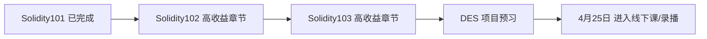

## 4月25日前学习计划

### 第 1 阶段：`4/8 - 4/14`

目标：
- 优先完成 `Solidity102` 的高收益章节。

章节清单：

| 顺序 | 章节 |
|---|---|
| 1 | `Fallback` |
| 2 | `Interact with Contract` |
| 3 | `Call` |
| 4 | `Delegatecall` |
| 5 | `ABI Encoding and Decoding` |
| 6 | `Hash` |
| 7 | `Function Selector` |
| 8 | `Try Catch` |

### 第 2 阶段：`4/15 - 4/20`

目标：
- 优先完成 `Solidity103` 中最贴近 DES 的章节。

章节清单：

| 顺序 | 章节 |
|---|---|
| 1 | `ERC20` |
| 2 | `Digital Signature / EIP712` |
| 3 | `ERC4626` |
| 4 | `Proxy Contract` |
| 5 | `Transparent Proxy` |
| 6 | `UUPS` |
| 7 | `Multisignature Wallet` |

### 第 3 阶段：`4/21 - 4/24`

目标：
- 不再继续铺新课，转入 DES 业务预习和最小模拟实战。

任务清单：

| 顺序 | 任务 |
|---|---|
| 1 | 理解 `Vault / LP / shares` |
| 2 | 理解 `Oracle` 价格来源 |
| 3 | 理解 `Liquidation` 清算流程 |
| 4 | 理解 `Multisig / Timelock / UUPS` 权限结构 |
| 5 | 做 1 个最小 DES 风格合约练习 |

## VS Code 接力要求

后续在 VS Code 中继续学习时，默认遵守以下顺序：

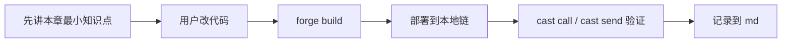

对后续 Codex 的明确要求：
- 不要默认继续完整刷完 `102` 或 `103`。
- 必须优先执行本记录里的高收益章节清单。
- 每完成一个章节，继续同步更新 `学习笔记.md` 和 `交接记录.md`。
- 如果用户时间紧张，优先保留 `102` 的调用类章节和 `103` 的 `ERC20 / EIP712 / ERC4626 / Proxy / UUPS / Multisig`。

## 当前进度


## 已完成内容

| 项目 | 状态 |
|---|---|
| 学习文件夹创建 | 已完成 |
| `README.md` 学习指导 | 已完成 |
| `Solidity101` 课程结构整理 | 已完成 |
| 每章学习目标整理 | 已完成 |
| `Foundry` 本地环境安装 | 已完成 |
| `hello-web3` 项目初始化 | 已完成 |
| `remappings.txt` 生成 | 已完成 |
| 第一个 `HelloWeb3` 合约 | 已完成 |
| 第一次 `forge build` | 已通过 |
| `HelloWeb3` 检查题 | 已通过 |
| `ValueTypes` 合约 | 已完成 |
| 第 2 章首次编译 | 已通过且无警告 |
| `ValueTypes` 检查题 | 已完成，整体通过 |
| `FunctionsDemo` 合约 | 已完成 |
| 第 3 章首次编译 | 已通过 |
| 第 3 章检查题 | 已完成，待进入函数调用实操 |
| 第 3 章函数调用实操 | 已完成 |
| 本地链常用命令笔记 | 已补充到 `学习笔记.md` |
| 单仓库改造 | 已完成 |
| ABI / cast 签名笔记 | 已补充到 `学习笔记.md` |
| 第 4 章 Function Output | 已完成 |
| 第 5 章 Data Storage and Scope | 已完成 |
| 第 6 章 Array & Struct | 已完成 |
| 第 7 章 Mapping | 已完成 |
| 第 8 章 Initial Value | 已完成 |
| 第 9 章 Constant and Immutable | 已完成 |
| 第 10 章 Control Flow | 已完成 |
| 第 11 章 constructor and modifier | 已完成 |
| 第 12 章 Events | 已完成 |
| 第 13 章 Inheritance | 已完成 |
| 第 14 章 Abstract and Interface | 已完成 |
| 第 15 章 Errors | 已完成 |

## 本次新增进度

| 项目 | 结果 |
|---|---|
| 学习方式确认 | 不使用 `Remix`，改为本地学习 |
| 工具选择 | 选择 `Foundry` |
| 环境状态 | `forge` 已可用 |
| 当前版本 | `forge 1.5.1-stable` |
| 本地项目 | `hello-web3` 已初始化 |
| 编辑器导入警告 | 已通过 `remappings.txt` 解决 |
| 工作区兼容配置 | 已新增 `.vscode/settings.json` |
| 第 1 章进度 | 已完成第一个最小合约并编译通过 |
| 第 1 章状态 | 已通过，可进入第 2 章 |
| 第 2 章进度 | 已完成值类型合约并编译通过 |
| 第 2 章状态 | 已基本通过，可进入第 3 章 |
| 第 3 章进度 | 已完成函数练习合约并编译通过 |
| 第 3 章当前重点 | 进入“部署并调用函数”实操 |
| 第 3 章状态 | 已完成函数部署调用闭环 |
| 当前工具主线 | `Foundry` |
| `Hardhat` 状态 | 暂未开始，后续需与 `Foundry` 分开记录 |
| Git 结构 | 已从嵌套仓库改为外层单仓库统一管理 |
| 第 4 章状态 | 已完成返回值、tuple、解构赋值和 cast 验证 |
| 第 5 章状态 | 已完成 storage/memory/calldata 和 cast 验证 |
| 第 6 章状态 | 已完成数组、结构体、部署与 cast 验证 |
| 第 6 章易错点 | 已记录：状态变量默认在 `storage`，不是因为 `public` 才上链 |
| 第 7 章状态 | 已完成 mapping、默认值、部署与 cast 验证 |
| 第 7 章疑问 | 已记录：默认值是否有业务意义，取决于 value 类型和业务语义 |
| 第 8 章状态 | 已完成基础类型、数组、结构体默认值与 `delete` 练习 |
| 第 8 章易错点 | 已记录：`delete` 是重置默认值；`mapping` 不能整体 `delete` |
| 第 9 章状态 | 已完成 `constant`、`immutable`、部署与 cast 验证 |
| 第 9 章易错点 | 已记录：`public` 是可见性；`constant/immutable` 是可变性 |
| 第 10 章状态 | 已完成 `if/else`、`for`、部署与 cast 验证 |
| 第 10 章易错点 | 已记录：循环结束条件要看继续条件；链上循环要关注 gas |
| 第 11 章状态 | 已完成 `constructor`、`modifier`、权限验证与 cast 实操 |
| 第 11 章易错点 | 已记录：`_` 是执行位置；前导 `_` 只是命名习惯，不是权限关键字 |
| 第 12 章状态 | 已完成 `event`、`emit`、部署与日志验证 |
| 第 12 章疑问 | 已记录：`emit` 容易，难点在前端如何监听和处理链上事件 |
| 第 13 章状态 | 已完成继承、部署与 cast 验证 |
| 第 13 章体感 | 已记录：继承能减少重复逻辑，但会增加源码阅读负担 |
| 第 14 章状态 | 已完成接口、实现合约、部署与 cast 验证 |
| 第 14 章发散问题 | 已记录：接口不提供默认实现；主要用于统一外部调用规则 |
| 第 15 章状态 | 已完成 `require`、`assert`、自定义 `error` 与 cast 验证 |
| 第 15 章易错点 | 已记录：改完源码只 build 不会影响旧合约地址，错误类型变化后必须重新部署 |

本次完成流程：


## 我是怎么通过 opencli 找到 WTF Academy 的

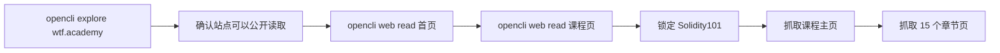

具体过程：

| 步骤 | 说明 |
|---|---|
| 1 | 先用 `opencli explore https://wtf.academy` 探测站点，确认它可以被公开读取 |
| 2 | 再用 `opencli web read --url https://wtf.academy` 抓首页 |
| 3 | 再用 `opencli web read --url https://www.wtf.academy/en/course` 抓课程页 |
| 4 | 然后直接验证 `https://www.wtf.academy/en/course/solidity101` 这门课程存在 |
| 5 | 抓取 `Solidity101` 主页，提取出 15 个章节链接 |
| 6 | 再逐章抓取 `HelloWeb3` 到 `Errors` 的章节正文 |
| 7 | 最后把课程主页和章节内容整理成 `README.md` |

## 当前文件

| 文件 | 用途 |
|---|---|
| `README.md` | Solidity101 学习指导主文档 |
| `交接记录.md` | 给 VS Code Codex 插件继续接力用 |

## 下一步学习任务

1. 已完成 Solidity101 全部 `15` 章。
2. 下一步不是完整刷完 `102 + 103`，而是先进入 `Solidity102` 高收益章节。
3. 第一章从 `Fallback` 开始。
4. 每章继续保持“讲解 -> 改代码 -> build -> 部署 -> cast 验证 -> 检查题 -> 记录”的节奏。

## 在 VS Code Codex 插件中可直接使用的提示词

```text
请读取当前目录下 wtf-academy-学习指导/README.md 和 wtf-academy-学习指导/交接记录.md。
我们继续学习 WTF Academy。
请先读取当前目录下 wtf-academy-学习指导/README.md、学习笔记.md、交接记录.md。
现在不要从 Solidity101 重新开始，而是按交接记录里的冲刺计划推进。
我现在要从 Solidity102 的 Fallback 开始，请你像老师一样监督我学习：
1. 先用简洁的话讲这一章重点
2. 再让我亲手改代码
3. 然后带我 forge build、部署、cast 验证
4. 再出 3 个检查题
5. 通过后更新 md 文档，再决定是否进入下一章
```

## 目标

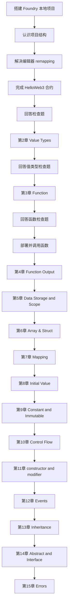

现在已经完成 Solidity101 全部 `15` 章，可以进入 DApp 对接实战。

## DApp 最小实战阶段进度

### 当前进度

```mermaid
flowchart LR
A[Solidity101 15章完成] --> B[进入 DApp 最小实战]
B --> C[编写 MinimalDapp 合约]
C --> D[forge build]
D --> E[部署到 anvil]
E --> F[cast call 读取 count 和 owner]
F --> G[cast send 成功执行 increment]
G --> H[cast send 成功执行 setCount(5)]
H --> I[验证 CountTooSmall(5,3)]
I --> J[验证 NotOwner()]
J --> K[cast logs 查看 CountUpdated]
K --> L[搭建 React + Vite 前端]
L --> M[前端读取 count 和 owner]
M --> N[MetaMask 连接成功]
N --> O[给前端钱包补本地测试 ETH]
O --> P[前端 increment() 交易确认]
P --> Q[anvil 重启后本地链重置]
Q --> R[重新部署 MinimalDapp]
R --> S[给 MetaMask 账户补测试 ETH]
S --> T[前端恢复读取 count 和 owner]
```

### 已完成内容

| 项目 | 状态 |
|---|---|
| DApp 最小合约设计 | 已完成 |
| `MinimalDapp.sol` 编写 | 已完成 |
| `forge build` | 已通过 |
| 本地链 `anvil` 启动 | 已完成 |
| `MinimalDapp` 部署 | 已完成 |
| `count()` / `owner()` 读取 | 已完成 |
| `increment()` 写操作验证 | 已完成 |
| `setCount(5)` 写操作验证 | 已完成 |
| `CountTooSmall(5, 3)` 错误验证 | 已完成 |
| `NotOwner()` 错误验证 | 已完成 |
| `cast logs` 事件日志验证 | 已完成 |
| `MinimalDapp.sol` 学习注释补充 | 已完成 |
| `frontend` 最小页面搭建 | 已完成 |
| 前端读链 | 已完成 |
| MetaMask 自定义网络切换 | 已完成 |
| 前端钱包测试 ETH 补充 | 已完成 |
| 前端 `increment()` 写交易 | 已完成 |
| 本地链重置原因排查 | 已完成 |
| `MinimalDapp` 重新部署恢复 | 已完成 |
| MetaMask 测试 ETH 二次补充 | 已完成 |
| 前端恢复读取 | 已完成 |
| `setCount(5)` 权限失败原因厘清 | 已完成 |
| 前端错误提示收口 | 已完成 |

### 本次新增结论

| 项目 | 结果 |
|---|---|
| 当前工具主线 | 继续使用 `Foundry` |
| 当前实战目标 | 先做最小闭环：钱包连接、读、写、确认、事件、错误 |
| 当前合约 | `hello-web3/src/MinimalDapp.sol` |
| 当前合约地址 | `0x9fE46736679d2D9a65F0992F2272dE9f3c7fa6e0` |
| 当前前端目录 | `hello-web3/frontend` |
| `call` 的定位 | 主动读取当前链上状态 |
| `event` 的定位 | 被动感知链上变化 |
| ABI 的作用 | 不只调函数，也用于解码错误和事件 |
| 当前阶段学习方式 | 命令由用户手动执行，避免我代跑 |
| 前端读链能力 | 已用 `publicClient.readContract` 打通 |
| 前端写链能力 | 已用 MetaMask + `walletClient.writeContract` 打通 |
| 本地链重置结论 | 旧数据不是被篡改，而是已经切到新的 `anvil` 链实例 |
| 当前页面状态 | 当前新链上 `count = 0`，`owner = 0xf39Fd6e51aad88F6F4ce6aB8827279cffFb92266` |
| `setCount(5)` 当前定位 | 用于演示权限失败和错误提示，不是当前成功写入示例 |
| 当前前端收口范围 | 先做 `setCount(5)` 预期提示 + 链上错误翻译 |
| 当前错误处理能力 | 已能区分用户取消、`NotOwner()`、`CountTooSmall(...)` |
| 当前事件监听状态 | 已恢复最小版 `CountUpdated` 监听，并在收到事件后自动刷新 |
| 当前前端验证 | `npm run build` 已通过 |
| 用户取消分支验证 | 已完成；控制台错误链落到 `UserRejectedRequestError` |
| `viem` 错误层级排查 | 已完成；自定义错误应优先从 `ContractFunctionRevertedError.data.errorName` 读取 |
| 事件监听最小版 | 已完成；当前页面同时保留“手动刷新”和“事件触发刷新”两条路径 |
| 事件监听浏览器验证 | 已完成；重启浏览器后可看到“开始监听 / 监听到 CountUpdated 事件”日志 |
| 输入式写交易主线 | 已新增 `increaseBy(step)`，用于避开 owner 限制练前端表单交互 |
| 合约重部署后前端联调 | 已完成；`App.jsx` 地址已同步，网页实测通过 |
| 新练习 `MessageBoard` 起步 | 已完成；合约已创建并通过 `forge build` |
| `MessageBoard` 命令行闭环 | 已完成；已通过 `cast call/send/call` 验证字符串读写 |
| `MessageBoard` 前端接入 | 已完成；`App.jsx` 已切换到留言板页面并通过 `vite build` |
| `MessageBoard` 网页实测 | 已完成；当前 `App.jsx` 可正常读取和写入留言 |
| 前端归档文件 | 已完成；`App.messageboard.jsx` 和 `App.minimaldapp.jsx` 已保存 |
| `MessageBoard` 双层校验 | 已完成；前端拦空输入，合约用 `require(..., "Empty message")` 兜底 |
| `MessageBoard` author 扩展 | 已完成；合约和前端都已支持显示当前留言作者 |
| `MessageBoard` 新地址同步 | 已完成；当前地址为 `0x0165878A594ca255338adfa4d48449f69242Eb8F` |

### 当前文件

| 文件 | 用途 |
|---|---|
| `hello-web3/src/MinimalDapp.sol` | DApp 最小实战主合约 |
| `hello-web3/src/MessageBoard.sol` | 新一轮最小 DApp 练习合约 |
| `hello-web3/frontend/src/App.jsx` | 当前运行中的 MessageBoard 页面 |
| `hello-web3/frontend/src/App.messageboard.jsx` | MessageBoard 版本归档 |
| `hello-web3/frontend/src/App.minimaldapp.jsx` | MinimalDapp 版本归档 |
| `学习笔记.md` | 已补充本节命令、易错点和结论 |
| `交接记录.md` | 已补充当前 DApp 阶段进度 |

### 下一步任务

1. 用户手动重新部署 `MessageBoard` 新版本，并把最新地址同步到 `App.jsx`。
2. 用户验证页面能同时读取 `message` 和 `author`，并在发新留言后自动更新两者。

## Solidity102 第 16 章启动

### 当前进度

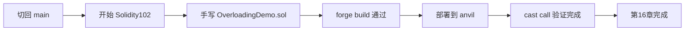

### 已完成内容

| 项目 | 状态 |
|---|---|
| 第 `16` 章起点确认 | 已完成 |
| `hello-web3/src/OverloadingDemo.sol` | 已完成 |
| `forge build` | 已通过 |
| `OverloadingDemo` 本地部署 | 已完成 |
| 当前合约地址 | `0x5FbDB2315678afecb367f032d93F642f64180aa3` |
| `cast call` 验证 | 已完成 |

### 当前文件

| 文件 | 用途 |
|---|---|
| `hello-web3/src/OverloadingDemo.sol` | Solidity102 第 16 章重载练习 |
| `学习笔记.md` | 已补充 Overloading 章节笔记 |
| `交接记录.md` | 已补充当前起步状态 |

### 下一步任务

1. 进入第 `17` 章 `Library`。
2. 手写 `MathLibrary.sol` 和 `LibraryDemo.sol`。
3. 通过 `forge build`、部署、`cast call` 完成闭环。

## Solidity102 第 17 章 Library

### 当前进度


### 已完成内容

| 项目 | 状态 |
|---|---|
| `hello-web3/src/MathLibrary.sol` | 已完成 |
| `hello-web3/src/LibraryDemo.sol` | 已完成 |
| `import {MathLibrary} from "./MathLibrary.sol";` | 已验证 |
| `forge build` | 已通过 |
| `LibraryDemo` 本地部署 | 已完成 |
| 当前合约地址 | `0xe7f1725E7734CE288F8367e1Bb143E90bb3F0512` |
| `cast call getMax(...)` | 已完成 |
| 开源库生态补充 | 已完成 |

### 当前判断

| 问题 | 结论 |
|---|---|
| Solidity 有没有像 lodash 一样的库 | 有 |
| 当前最值得先认识的库 | `OpenZeppelin Contracts` |
| Foundry 能不能像 npm 一样装库 | 能，用 `forge install` |

### 下一步任务

1. 开始第 `18` 章 `Import`。
2. 先比较 `import "./A.sol";` 和 `import {A} from "./A.sol";`。
3. 继续按“讲最小知识点 -> 你手敲 -> `forge build`”推进。

## 4月25日前冲刺线 当前进度

### 当前进度

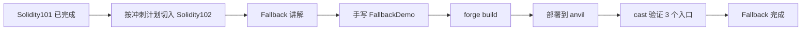

### 已完成内容

| 项目 | 状态 |
|---|---|
| 冲刺路线切换到 `4/25` 前主线 | 已完成 |
| `hello-web3/src/FallbackDemo.sol` | 已完成 |
| `hello-web3/script/FallbackDemo.s.sol` | 已完成 |
| `forge build` | 已通过 |
| `FallbackDemo` 本地部署 | 已完成 |
| 当前合约地址 | `0x5FbDB2315678afecb367f032d93F642f64180aa3` |
| `deposit / receive / fallback` 三路验证 | 已完成 |
| `receive()` 不能读 `msg.data` 这个坑 | 已确认并记录 |
| `cast send` 原始 calldata 写法 | 已确认并记录 |

### 当前判断

| 问题 | 结论 |
|---|---|
| `Fallback` 是否属于高收益章节 | 是，后面学 `Call / Delegatecall / Proxy` 都会用到 |
| 本章最核心收获 | 理清 3 个入口的触发条件 |
| 当前工具路线 | 继续使用 `Foundry` |
| 当前节奏 | 继续按“讲解 -> 改代码 -> build -> 部署 -> cast -> 检查题 -> 更新 md”推进 |

### 当前文件

| 文件 | 用途 |
|---|---|
| `hello-web3/src/FallbackDemo.sol` | `Fallback` 章节练习合约 |
| `hello-web3/script/FallbackDemo.s.sol` | `FallbackDemo` 部署脚本 |
| `学习笔记.md` | 已补充本章命令、易错点和结论 |
| `交接记录.md` | 已补充本章冲刺进度 |

### 下一步任务

1. 进入 `Solidity102` 的 `Interact with Contract`。
2. 学合约 A 调合约 B 的最小闭环。
3. 继续用 `forge build + 部署 + cast` 做调用验证。

## Solidity102 第 19 章 Fallback 手敲闭环

### 当前进度


### 已完成内容

| 项目 | 状态 |
|---|---|
| `hello-web3/src/FallbackDemoV2.sol` | 已完成 |
| `hello-web3/script/FallbackDemoV2.s.sol` | 已完成 |
| 用户手动 `forge build` | 已通过 |
| 用户手动部署到本地链 | 已完成 |
| 当前手敲版合约地址 | `0x5FbDB2315678afecb367f032d93F642f64180aa3` |
| `deposit()` 入口验证 | 已完成 |
| `receive()` 入口验证 | 已完成 |
| `fallback()` 入口验证 | 已完成 |
| `wei / ether` 单位问题 | 已讲清 |
| `msg.data` 与 `lastData` 区别 | 已讲清 |

### 当前判断

| 问题 | 结论 |
|---|---|
| 当前学习方式 | 以后默认由用户手动敲代码、手动执行命令 |
| 本章是否通过 | 已通过 |
| 用户当前易混点 | “当次调用的 `msg.data`” 和 “链上当前的 `lastData`” 容易混淆，但本轮已厘清 |
| 下一章最小目标 | `Interact with Contract`：理解合约 A 如何通过地址调用合约 B |

### 当前文件

| 文件 | 用途 |
|---|---|
| `hello-web3/src/FallbackDemo.sol` | Fallback 参考答案版 |
| `hello-web3/script/FallbackDemo.s.sol` | 参考答案版部署脚本 |
| `hello-web3/src/FallbackDemoV2.sol` | 用户手敲练习版 |
| `hello-web3/script/FallbackDemoV2.s.sol` | 用户手敲练习版部署脚本 |
| `学习笔记.md` | 已补充本章手敲结论 |
| `交接记录.md` | 已补充本章完成进度 |

### 下一步任务

1. 开始 `Solidity102` 的 `Interact with Contract`。
2. 继续沿用“讲解 -> 你手敲 -> `forge build` -> 部署 -> `cast` 验证 -> 检查题”的节奏。
3. 先做最小版 `Target + Caller` 两合约调用闭环。

## Solidity102 第 20 章 Interact with Contract

### 当前进度

```mermaid
flowchart LR
A[Fallback 完成] --> B[手敲 TargetDemo]
B --> C[手敲 CallerDemo]
C --> D[手敲部署脚本]
D --> E[forge build 通过]
E --> F[部署 TargetDemo 和 CallerDemo]
F --> G[初始读取验证]
G --> H[调用 CallerDemo.callSetNumber(7)]
H --> I[二次读取验证]
I --> J[第20章完成]
```

### 已完成内容

| 项目 | 状态 |
|---|---|
| `hello-web3/src/TargetDemo.sol` | 已完成 |
| `hello-web3/src/CallerDemo.sol` | 已完成 |
| `hello-web3/script/InteractDemo.s.sol` | 已完成 |
| 用户手动 `forge build` | 已通过 |
| 用户手动部署到本地链 | 已完成 |
| `TargetDemo` 地址 | `0x5FbDB2315678afecb367f032d93F642f64180aa3` |
| `CallerDemo` 地址 | `0xe7f1725E7734CE288F8367e1Bb143E90bb3F0512` |
| 初始读取 `0 / 0` | 已完成 |
| 跨合约写入 `callSetNumber(7)` | 已完成 |
| 二次读取 `7 / 7` | 已完成 |

### 当前判断

| 问题 | 结论 |
|---|---|
| 本章是否通过 | 已通过 |
| 用户当前学习方式 | 继续保持“我讲解，用户手敲、手跑命令” |
| 本章最关键理解 | 目标地址决定“调谁”，函数选择器决定“调哪个函数” |
| 用户已厘清 | `TargetDemo(targetAddress)` 不是重新部署，而是地址类型转换 |

### 当前文件

| 文件 | 用途 |
|---|---|
| `hello-web3/src/TargetDemo.sol` | 被调用方合约 |
| `hello-web3/src/CallerDemo.sol` | 调用方合约 |
| `hello-web3/script/InteractDemo.s.sol` | 本章部署脚本 |
| `学习笔记.md` | 已补充本章命令与结论 |
| `交接记录.md` | 已补充本章完成进度 |

### 下一步任务

1. 进入 `Solidity102` 的 `Call`。
2. 学低级调用和返回值布尔结果。
3. 继续按“讲解 -> 手敲 -> build -> 部署 -> cast -> 检查题”的顺序推进。

## Solidity102 第 21 章 Call

### 当前进度

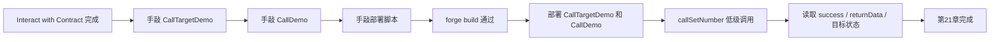

### 已完成内容

| 项目 | 状态 |
|---|---|
| `hello-web3/src/CallTargetDemo.sol` | 已完成 |
| `hello-web3/src/CallDemo.sol` | 已完成 |
| `hello-web3/script/CallDemo.s.sol` | 已完成 |
| 用户手动 `forge build` | 已通过 |
| 用户手动部署到本地链 | 已完成 |
| `CallTargetDemo` 地址 | `0xCf7Ed3AccA5a467e9e704C703E8D87F634fB0Fc9` |
| `CallDemo` 地址 | `0xDc64a140Aa3E981100a9becA4E685f962f0cF6C9` |
| 低级 `call` 写入验证 | 已完成 |
| `success / returnData / value` | 已讲清 |

### 当前判断

| 问题 | 结论 |
|---|---|
| 本章是否通过 | 已通过 |
| 本章最关键理解 | `call` 是“地址 + calldata”的低级调用 |
| 用户已厘清 | `returnData` 是原始 ABI bytes，不是自动解码后的值 |

## Solidity102 第 22 章 Delegatecall

### 当前进度


### 已完成内容

| 项目 | 状态 |
|---|---|
| `hello-web3/src/LogicDemo.sol` | 已完成 |
| `hello-web3/src/DelegatecallDemo.sol` | 已完成 |
| `hello-web3/script/DelegatecallDemo.s.sol` | 已完成 |
| 用户手动 `forge build` | 已通过 |
| 用户手动部署到本地链 | 已完成 |
| `DelegatecallDemo` 地址 | `0xCf7Ed3AccA5a467e9e704C703E8D87F634fB0Fc9` |
| `LogicDemo` 地址 | `0x9fE46736679d2D9a65F0992F2272dE9f3c7fa6e0` |
| `delegatecall` 验证 | 已完成 |
| storage slot 对齐问题 | 已讲清 |

### 当前判断

| 问题 | 结论 |
|---|---|
| 本章是否通过 | 已通过 |
| 本章最关键理解 | 借用别人的代码，修改自己的 storage |
| 当前高风险点 | storage layout / slot 顺序是实际工程里的高风险点 |

## Solidity102 第 23 章 ABI Encoding and Decoding

### 当前进度

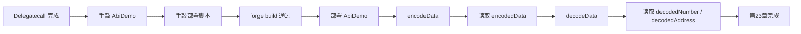

### 已完成内容

| 项目 | 状态 |
|---|---|
| `hello-web3/src/AbiDemo.sol` | 已完成 |
| `hello-web3/script/AbiDemo.s.sol` | 已完成 |
| 用户手动 `forge build` | 已通过 |
| 用户手动部署到本地链 | 已完成 |
| `AbiDemo` 地址 | `0x5FC8d32690cc91D4c39d9d3abcBD16989F875707` |
| `encode -> decode` 闭环 | 已完成 |
| 外层 bytes 包装和内层真实编码 | 已讲清 |

### 当前判断

| 问题 | 结论 |
|---|---|
| 本章是否通过 | 已通过 |
| 本章最关键理解 | `encode` 得到 bytes，`decode` 时类型和顺序必须一致 |
| 用户已厘清 | 函数调用本身的 calldata 不等于 `abi.encode(...)` 生成的数据 |

### 下一步任务

1. 进入 `Solidity102` 的 `Hash`。
2. 学 `keccak256` 和最小哈希验证。
3. 继续按“讲解 -> 手敲 -> build -> 部署 -> cast -> 检查题”的顺序推进。

## Solidity102 第 24 章 Hash

### 当前进度

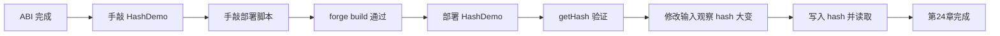

### 已完成内容

| 项目 | 状态 |
|---|---|
| `hello-web3/src/HashDemo.sol` | 已完成 |
| `hello-web3/script/HashDemo.s.sol` | 已完成 |
| 用户手动 `forge build` | 已通过 |
| 用户手动部署到本地链 | 已完成 |
| `HashDemo` 地址 | `0xCf7Ed3AccA5a467e9e704C703E8D87F634fB0Fc9` |
| `getHash / hash` 闭环 | 已完成 |
| `encode` 与 `hash` 关系 | 已讲清 |

### 当前判断

| 问题 | 结论 |
|---|---|
| 本章是否通过 | 已通过 |
| 本章最关键理解 | 先 `abi.encode`，再 `keccak256` |
| 用户已厘清 | 相同输入同样哈希，输入改一点结果会大变 |

## Solidity102 第 25 章 Function Selector

### 当前进度

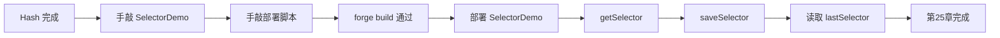

### 已完成内容

| 项目 | 状态 |
|---|---|
| `hello-web3/src/SelectorDemo.sol` | 已完成 |
| `hello-web3/script/SelectorDemo.s.sol` | 已完成 |
| 用户手动 `forge build` | 已通过 |
| 用户手动部署到本地链 | 已完成 |
| `SelectorDemo` 地址 | `0x5FC8d32690cc91D4c39d9d3abcBD16989F875707` |
| `getSelector / saveSelector / lastSelector` | 已完成 |
| selector 定义 | 已讲清 |

### 当前判断

| 问题 | 结论 |
|---|---|
| 本章是否通过 | 已通过 |
| 本章最关键理解 | selector 只看函数名 + 参数类型 |
| 用户已厘清 | `msg.data` 前 4 字节的重要性 |

## Solidity102 第 26 章 Try Catch

### 当前进度

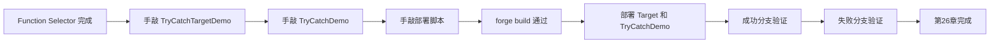

### 已完成内容

| 项目 | 状态 |
|---|---|
| `hello-web3/src/TryCatchTargetDemo.sol` | 已完成 |
| `hello-web3/src/TryCatchDemo.sol` | 已完成 |
| `hello-web3/script/TryCatchDemo.s.sol` | 已完成 |
| 用户手动 `forge build` | 已通过 |
| 用户手动部署到本地链 | 已完成 |
| `TryCatchTargetDemo` 地址 | `0xa513E6E4b8f2a923D98304ec87F64353C4D5C853` |
| `TryCatchDemo` 地址 | `0x2279B7A0a67DB372996a5FaB50D91eAA73d2eBe6` |
| 成功分支验证 | 已完成 |
| 失败分支验证 | 已完成 |

### 当前判断

| 问题 | 结论 |
|---|---|
| 本章是否通过 | 已通过 |
| 本章最关键理解 | 被调合约失败了，调用方仍可在 `catch` 中继续处理 |
| 用户已厘清 | `try ... returns (...)` 写的是被调函数成功返回的值 |

## Solidity102 冲刺主线当前结论

### 当前进度

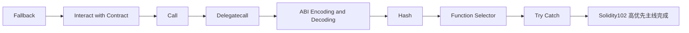

### 已完成内容

| 项目 | 状态 |
|---|---|
| Solidity102 高优先章节 `8/8` | 已完成 |
| 当前学习方式 | 已稳定为“我讲解，用户手敲、手跑命令” |
| 当前主线下一步 | 进入 Solidity103 高优先章节 |

### 下一步任务

1. 进入 `Solidity103` 的 `ERC20`。
2. 继续按“讲解 -> 手敲 -> build -> 部署 -> cast -> 检查题”的顺序推进。
3. 在 `4/25` 前优先清掉 `ERC20 / EIP712 / ERC4626 / Proxy / UUPS / Multisig`。

## Solidity103 第 1 章 ERC20

### 当前进度

```mermaid
flowchart LR
A[Solidity102 高优先主线完成] --> B[进入 Solidity103 ERC20]
B --> C[先拆最小认知：总量 余额 授权]
C --> D[用户手敲 ERC20Demo]
D --> E[用户手敲 ERC20Demo.s.sol]
E --> F[用户手动 forge build]
F --> G[用户手动 anvil]
G --> H[用户手动脚本部署]
H --> I[cast call 验证初始状态]
I --> J[cast send transfer]
J --> K[cast send approve]
K --> L[cast send transferFrom]
L --> M[第1章完成]
```

### 已完成内容

| 项目 | 状态 |
|---|---|
| `hello-web3/src/ERC20Demo.sol` | 已完成 |
| `hello-web3/script/ERC20Demo.s.sol` | 已完成 |
| 用户手动 `forge build` | 已通过 |
| 用户手动部署到本地链 | 已完成 |
| 当前合约地址 | `0x5FbDB2315678afecb367f032d93F642f64180aa3` |
| 初始 `name / symbol / totalSupply / balanceOf` | 已验证 |
| `transfer` | 已验证 |
| `approve` | 已验证 |
| `transferFrom` | 已验证 |
| 当前学习方式 | 已继续保持“我讲解，用户手敲、手跑命令” |

### 当前判断

| 问题 | 结论 |
|---|---|
| 本章是否通过 | 已通过 |
| 本章最关键理解 | `balanceOf` 是余额，`allowance` 是代扣额度 |
| 用户当前已厘清 | `approve` 不转钱；`transferFrom` 既要检查额度，也要检查真实余额 |
| 当前教学节奏 | 继续按“最小认知 -> 手敲 -> 手跑命令 -> 检查题 -> 记录”推进 |

### 当前文件

| 文件 | 用途 |
|---|---|
| `hello-web3/src/ERC20Demo.sol` | ERC20 最小练习合约 |
| `hello-web3/script/ERC20Demo.s.sol` | ERC20 部署脚本 |
| `学习笔记.md` | 已补充本章命令、易错点和结论 |
| `交接记录.md` | 已补充本章完成进度 |

### 下一步任务

1. 进入 `Solidity103` 的 `Digital Signature / EIP712`。
2. 继续保持“我先拆最小认知，你手敲代码和手跑命令”的方式。
3. 优先把“签名是什么、链上如何验签、EIP712 和普通签名差异”讲清。

## Solidity103 第 2 章 Digital Signature / EIP712 预热

### 当前进度

```mermaid
flowchart LR
A[ERC20 完成] --> B[进入 Digital Signature / EIP712]
B --> C[先不直接上 EIP712]
C --> D[先手敲 SignatureDemo]
D --> E[先讲 messageHash 和 ethSignedMessageHash]
E --> F[补参数类型：bytes32 / bytes]
F --> G[补数据位置：memory / calldata / storage]
```

### 已完成内容

| 项目 | 状态 |
|---|---|
| `hello-web3/src/SignatureDemo.sol` | 已手敲起步版 |
| 当前学习方式 | 继续保持“我讲解，用户手敲、手跑命令” |
| 当前最小目标 | 先讲清普通签名验签，再进入 `EIP712` |
| `memory / calldata` 补充记录 | 已同步到 `学习笔记.md` |

### 当前判断

| 问题 | 结论 |
|---|---|
| 当前是否进入正式部署阶段 | 还没有，先把参数类型和验签流程讲清 |
| 当前用户卡点 | `bytes32` vs `bytes`，以及引用类型参数为什么要写 `memory / calldata` |
| 当前最关键理解 | hash 常用 `bytes32`；签名常用 `bytes memory`；引用类型参数需要明确数据位置 |

### 下一步任务

1. 让用户手动 `forge build` 验证 `SignatureDemo.sol`。
2. 再补最小部署脚本 `SignatureDemo.s.sol`。
3. 然后进入“本地签名 -> 合约验签”的最小闭环。

## Solidity103 第 2 章 Digital Signature

### 当前进度

```mermaid
flowchart LR
A[ERC20 完成] --> B[手敲 SignatureDemo]
B --> C[补 memory / calldata / bytes32 / bytes]
C --> D[用户手动 forge build]
D --> E[用户手动脚本部署]
E --> F[getMessageHash]
F --> G[getEthSignedMessageHash]
G --> H[cast wallet sign --no-hash]
H --> I[recoverSigner]
I --> J[第2章完成]
```

### 已完成内容

| 项目 | 状态 |
|---|---|
| `hello-web3/src/SignatureDemo.sol` | 已完成 |
| `hello-web3/script/SignatureDemo.s.sol` | 已完成 |
| 用户手动 `forge build` | 已通过 |
| 用户手动部署到本地链 | 已完成 |
| 当前合约地址 | `0x5FbDB2315678afecb367f032d93F642f64180aa3` |
| 普通签名验签闭环 | 已完成 |
| `memory / calldata` 补充记录 | 已同步到 `学习笔记.md` |

### 当前判断

| 问题 | 结论 |
|---|---|
| 本章是否通过 | 已通过 |
| 本章最关键理解 | 普通签名主线是 `messageHash -> ethSignedMessageHash -> sign -> recoverSigner` |
| 用户已厘清 | `bytes32` 常用于 hash；`bytes memory` 常用于签名 |

## Solidity103 第 3 章 EIP712

### 当前进度

```mermaid
flowchart LR
A[Digital Signature 完成] --> B[手敲 EIP712Demo]
B --> C[讲 domain / type / struct]
C --> D[用户手动 forge build]
D --> E[用户手动脚本部署]
E --> F[getDomainSeparator]
F --> G[getStructHash]
G --> H[getTypedDataHash]
H --> I[准备 mail.json]
I --> J[cast wallet sign --data]
J --> K[recoverSigner]
K --> L[第3章完成]
```

### 已完成内容

| 项目 | 状态 |
|---|---|
| `hello-web3/src/EIP712Demo.sol` | 已完成 |
| `hello-web3/script/EIP712Demo.s.sol` | 已完成 |
| 用户手动 `forge build` | 已通过 |
| 用户手动部署到本地链 | 已完成 |
| 当前合约地址 | `0x9fE46736679d2D9a65F0992F2272dE9f3c7fa6e0` |
| `domainSeparator / structHash / typedDataHash` | 已验证 |
| EIP712 签名恢复闭环 | 已完成 |
| 旧签名在新合约失效原因 | 已讲清并验证 |

### 当前判断

| 问题 | 结论 |
|---|---|
| 本章是否通过 | 已通过 |
| 本章最关键理解 | EIP712 是“带上下文的结构化签名” |
| 当前最值钱结论 | `verifyingContract` 变了，domain 就变了，旧签名不能在新合约复用 |
| 当前学习方式 | 继续保持“我讲解，用户手敲、手跑命令” |

### 当前文件

| 文件 | 用途 |
|---|---|
| `hello-web3/src/SignatureDemo.sol` | 普通签名验签练习合约 |
| `hello-web3/script/SignatureDemo.s.sol` | 普通签名部署脚本 |
| `hello-web3/src/EIP712Demo.sol` | EIP712 最小练习合约 |
| `hello-web3/script/EIP712Demo.s.sol` | EIP712 部署脚本 |
| `学习笔记.md` | 已补充两章命令、易错点和结论 |
| `交接记录.md` | 已补充两章完成进度 |

### 下一步任务

1. 进入 `Solidity103` 的 `ERC4626`。
2. 继续沿用“先讲最小认知，再让用户手敲和手跑命令”的方式。
3. 先把 `asset / share / deposit / redeem` 这几个最小概念讲清。

## Solidity103 第 4 章 ERC4626

### 当前进度

```mermaid
flowchart LR
A[EIP712 完成] --> B[进入 ERC4626]
B --> C[先讲 asset / share / deposit / redeem]
C --> D[用户手敲 ERC4626Demo]
D --> E[用户手敲部署脚本]
E --> F[用户手动 forge build]
F --> G[用户手动脚本部署]
G --> H[cast call 初始状态]
H --> I[cast send deposit(100)]
I --> J[cast send redeem(40)]
J --> K[第4章完成]
```

### 已完成内容

| 项目 | 状态 |
|---|---|
| `hello-web3/src/ERC4626Demo.sol` | 已完成 |
| `hello-web3/script/ERC4626Demo.s.sol` | 已完成 |
| 用户手动 `forge build` | 已通过 |
| 用户手动部署到本地链 | 已完成 |
| 当前合约地址 | `0xCf7Ed3AccA5a467e9e704C703E8D87F634fB0Fc9` |
| 初始状态验证 | 已完成 |
| `deposit(100)` | 已验证 |
| `redeem(40)` | 已验证 |

### 当前判断

| 问题 | 结论 |
|---|---|
| 本章是否通过 | 已通过 |
| 本章最关键理解 | `asset` 是底层资产，`share` 是金库份额 |
| 用户已厘清 | `deposit = 存入 asset 拿 share`；`redeem = 交回 share 取回 asset` |
| 当前模型 | 先用固定 `1:1` 汇率理解金库记账，不急着上完整标准实现 |

### 当前文件

| 文件 | 用途 |
|---|---|
| `hello-web3/src/ERC4626Demo.sol` | ERC4626 最小练习合约 |
| `hello-web3/script/ERC4626Demo.s.sol` | ERC4626 部署脚本 |
| `学习笔记.md` | 已补充本章命令、易错点和结论 |
| `交接记录.md` | 已补充本章完成进度 |

### 下一步任务

1. 进入 `Solidity103` 的 `Proxy Contract`。
2. 继续保持“先讲最小认知，再让用户手敲和手跑命令”的方式。
3. 先把“为什么要代理、实现合约和代理合约怎么分工”讲清。

## Solidity103 第 5 章 Proxy Contract

### 当前进度

```mermaid
flowchart LR
A[ERC4626 完成] --> B[进入 Proxy Contract]
B --> C[先讲 Proxy / Implementation / delegatecall]
C --> D[用户手敲 LogicV1]
D --> E[用户手敲 ProxyDemo]
E --> F[用户手动 forge build]
F --> G[用户手动脚本部署]
G --> H[读取 implementation]
H --> I[读取两边 number 初始值]
I --> J[通过 Proxy 调 setNumber(7)]
J --> K[再次读取两边 number]
K --> L[第5章完成]
```

### 已完成内容

| 项目 | 状态 |
|---|---|
| `hello-web3/src/LogicV1.sol` | 已完成 |
| `hello-web3/src/ProxyDemo.sol` | 已完成 |
| `hello-web3/script/ProxyDemo.s.sol` | 已完成 |
| 用户手动 `forge build` | 已通过 |
| 用户手动部署到本地链 | 已完成 |
| `LogicV1` 地址 | `0x0165878A594ca255338adfa4d48449f69242Eb8F` |
| `ProxyDemo` 地址 | `0xa513E6E4b8f2a923D98304ec87F64353C4D5C853` |
| `implementation()` 验证 | 已完成 |
| 通过 Proxy 调 `setNumber(7)` | 已完成 |
| `LogicV1.number = 0` / `ProxyDemo.number = 7` | 已验证 |

### 当前判断

| 问题 | 结论 |
|---|---|
| 本章是否通过 | 已通过 |
| 本章最关键理解 | Proxy 负责入口，Implementation 负责逻辑，`delegatecall` 负责“借代码改 Proxy 状态” |
| 用户当前体感 | 已明确感受到 Proxy 语法反直觉，但也理解它服务于升级能力 |
| 当前最大风险点 | `storage layout`，不是普通函数调用 |

### 当前文件

| 文件 | 用途 |
|---|---|
| `hello-web3/src/LogicV1.sol` | 最小逻辑合约 |
| `hello-web3/src/ProxyDemo.sol` | 最小代理合约 |
| `hello-web3/script/ProxyDemo.s.sol` | Proxy 章节部署脚本 |
| `学习笔记.md` | 已补充本章命令、易错点和结论 |
| `交接记录.md` | 已补充本章完成进度 |

### 下一步任务

1. 进入 `Solidity103` 的 `Transparent Proxy`。
2. 继续沿用“3W + 手敲 + 手跑命令”的方式。
3. 重点讲清：为什么裸 Proxy 不够，还要引入 admin 隔离。

## Solidity103 第 6 章 Transparent Proxy 交接

### 当前进度

```mermaid
flowchart LR
A[Proxy Contract 已完成] --> B[进入 Transparent Proxy]
B --> C[先看 TransparentProxyDemo.s.sol]
C --> D[理解 USER / admin / initData]
D --> E[进入 constructor]
E --> F[发现 slot 是前置知识缺口]
F --> G[补 slot / sload / sstore / assembly]
G --> H[停在管理员函数讲解前]
```

### 当前判断

| 项目 | 结论 |
|---|---|
| 章节状态 | 未完成，当前停在“前置认知补课” |
| 当前卡点 | `slot`、`assembly`、`modifier` 的理解还需要落到代码上 |
| 已明确的主线 | Transparent Proxy = 管理员走管理函数，普通用户走 fallback 业务函数 |
| 当前最重要收获 | 已补清 `initData`、`USER/admin` 角色划分、slot 基础概念 |

### 当前文件状态

| 文件 | 状态 |
|---|---|
| `hello-web3/src/TransparentLogicV1.sol` | 已创建 |
| `hello-web3/src/TransparentLogicV2.sol` | 已创建 |
| `hello-web3/src/TransparentProxyDemo.sol` | 已创建，当前函数体大多未补完 |
| `hello-web3/script/TransparentProxyDemo.s.sol` | 已创建 |
| `学习笔记.md` | 已补充 Transparent Proxy 阶段性记录 |
| `交接记录.md` | 本次已更新 |

### 对下一个 Codex / 下次学习的明确要求

1. 不要直接跳到 `forge build`，先把 `TransparentProxyDemo.sol` 补完整。
2. 继续优先讲最小前置：
   - `ifAdmin`
   - `_getAdmin / _setAdmin`
   - `_getImplementation / _setImplementation`
   - `_fallback / _delegate`
3. 讲解时保持：
   - 简短 3W
   - 表格和流程图优先
   - 不替用户执行命令
4. 用户当前对 `slot` 和 `assembly` 已有第一轮认知，但还没落到完整代码闭环。

### 下一步任务

1. 补完 `TransparentProxyDemo.sol`。
2. 用户手动 `forge build`。
3. 用户手动部署 `TransparentProxyDemo.s.sol`。
4. 用 `cast` 验证：
   - admin 可查 `admin()/implementation()`
   - admin 不能走业务 fallback
   - USER 可走业务函数
   - 升级到 `TransparentLogicV2`
5. 出检查题并更新两份 md。

## Solidity103 第 6 章 Transparent Proxy

### 当前进度

```mermaid
flowchart LR
A[Proxy Contract 已完成] --> B[进入 Transparent Proxy]
B --> C[补 slot / assembly / modifier 前置]
C --> D[完成 TransparentLogicV1/V2]
D --> E[完成 TransparentProxyDemo]
E --> F[用户手动 forge build]
F --> G[用户手动部署到本地链]
G --> H[验证 admin / implementation]
H --> I[验证 owner / number / version]
I --> J[验证 USER 可调业务函数]
J --> K[验证 ADMIN 不能走业务 fallback]
K --> L[升级到 V2 并调用 increment]
```

### 当前判断

| 项目 | 结论 |
|---|---|
| 章节状态 | 已完成 |
| 当前最关键理解 | Transparent Proxy = 管理入口和业务入口分离 |
| 用户已掌握 | `slot`、`assembly`、`modifier`、`initData` 的最小理解 |
| 已验证核心行为 | USER 能调业务，ADMIN 不能调业务，但能升级实现合约 |

### 已完成内容

| 项目 | 状态 |
|---|---|
| `hello-web3/src/TransparentLogicV1.sol` | 已完成 |
| `hello-web3/src/TransparentLogicV2.sol` | 已完成 |
| `hello-web3/src/TransparentProxyDemo.sol` | 已完成 |
| `hello-web3/script/TransparentProxyDemo.s.sol` | 已完成 |
| 用户手动 `forge build` | 已通过 |
| 用户手动部署到本地链 | 已完成 |
| 初始化查询 | 已完成 |
| `USER setNumber(777)` | 已完成 |
| `ADMIN setNumber(888)` 失败验证 | 已完成 |
| `upgradeTo(LOGIC_V2)` | 已完成 |
| `USER increment()` | 已完成 |

### 当前文件状态

| 文件 | 用途 |
|---|---|
| `hello-web3/src/TransparentLogicV1.sol` | 初始逻辑合约 |
| `hello-web3/src/TransparentLogicV2.sol` | 升级后的逻辑合约 |
| `hello-web3/src/TransparentProxyDemo.sol` | Transparent Proxy 最小练习合约 |
| `hello-web3/script/TransparentProxyDemo.s.sol` | Transparent Proxy 部署脚本 |
| `学习笔记.md` | 已补充本章命令、易错点和结论 |
| `交接记录.md` | 本次已更新 |

### 下一步任务

1. 进入 `Solidity103` 的 `UUPS`。
2. 对比 Transparent Proxy 和 UUPS：
   - 升级函数放在哪
   - admin 权限放在哪
   - 为什么 UUPS 更轻
3. 继续沿用：
   - 3W 解释
   - 用户手敲
   - `forge build`
   - 部署
   - `cast` 验证
   - 检查题

## Solidity103 第 7 章 UUPS

### 当前进度

```mermaid
flowchart LR
A[Transparent Proxy 已完成] --> B[进入 UUPS]
B --> C[对比 Transparent 和 UUPS]
C --> D[完成 UUPSProxyDemo]
D --> E[完成 UUPSLogicV1/V2]
E --> F[完成部署脚本]
F --> G[用户手动 forge build]
G --> H[用户手动部署到本地链]
H --> I[验证 owner / number / version]
I --> J[USER 调 setNumber]
J --> K[USER 调 upgradeTo]
K --> L[USER 调 increment]
```

### 当前判断

| 项目 | 结论 |
|---|---|
| 章节状态 | 已完成 |
| 当前最关键理解 | UUPS = 升级逻辑在 implementation，不在 proxy |
| 用户已掌握 | UUPS 和 Transparent 的核心区别 |
| 已验证核心行为 | 通过 proxy 调 implementation 的 `upgradeTo` 完成升级 |

### 已完成内容

| 项目 | 状态 |
|---|---|
| `hello-web3/src/UUPSProxyDemo.sol` | 已完成 |
| `hello-web3/src/UUPSLogicV1.sol` | 已完成 |
| `hello-web3/src/UUPSLogicV2.sol` | 已完成 |
| `hello-web3/script/UUPSDemo.s.sol` | 已完成 |
| 用户手动 `forge build` | 已通过 |
| 用户手动部署到本地链 | 已完成 |
| 初始状态验证 | 已完成 |
| `USER setNumber(777)` | 已完成 |
| `USER upgradeTo(LOGIC_V2)` | 已完成 |
| `USER increment()` | 已完成 |

### 当前文件状态

| 文件 | 用途 |
|---|---|
| `hello-web3/src/UUPSProxyDemo.sol` | 最小 UUPS 代理 |
| `hello-web3/src/UUPSLogicV1.sol` | 最小 UUPS 逻辑 V1 |
| `hello-web3/src/UUPSLogicV2.sol` | 最小 UUPS 逻辑 V2 |
| `hello-web3/script/UUPSDemo.s.sol` | UUPS 部署脚本 |
| `学习笔记.md` | 已补充本章命令、易错点和结论 |
| `交接记录.md` | 本次已更新 |

### 下一步任务

1. 进入 `Solidity103` 最后一章高优先内容：`Multisignature Wallet`。
2. 重点讲清：
   - 为什么需要多签
   - 提案、确认、执行三步怎么走
   - 多签和单 owner 的区别
3. 继续沿用：
   - 3W 解释
   - 用户手敲
   - `forge build`
   - 部署
   - `cast` 验证
   - 检查题

## Solidity103 第 8 章 Multisignature Wallet

### 当前进度

```mermaid
flowchart LR
A[UUPS 已完成] --> B[进入 Multisignature Wallet]
B --> C[讲多签和单 owner 区别]
C --> D[完成 MultiSigWalletDemo]
D --> E[完成部署脚本]
E --> F[用户手动 forge build]
F --> G[用户手动部署到本地链]
G --> H[钱包收款 1 ETH]
H --> I[submit 提案]
I --> J[2 个 owner confirm]
J --> K[execute 执行]
K --> L[验证钱包和 owner3 余额变化]
```

### 当前判断

| 项目 | 结论 |
|---|---|
| 章节状态 | 已完成 |
| 当前最关键理解 | 多签 = 提案、确认、执行三段式 |
| 用户已掌握 | `indexed`、`txId`、`notApproved`、`execute` 的最小理解 |
| 当前遗留疑问 | 如果想让多签执行“目标合约的某个函数”，`to` 和 `data` 要怎么准备 |

### 已完成内容

| 项目 | 状态 |
|---|---|
| `hello-web3/src/MultiSigWalletDemo.sol` | 已完成 |
| `hello-web3/script/MultiSigWalletDemo.s.sol` | 已完成 |
| 用户手动 `forge build` | 已通过 |
| 用户手动部署到本地链 | 已完成 |
| 钱包收款 `1 ether` | 已完成 |
| `submit()` 提案 | 已完成 |
| `confirm()` 两人确认 | 已完成 |
| `execute()` 执行转账 | 已完成 |
| 钱包余额变化验证 | 已完成 |
| `owner3` 收款验证 | 已完成 |

### 当前文件状态

| 文件 | 用途 |
|---|---|
| `hello-web3/src/MultiSigWalletDemo.sol` | 最小多签钱包合约 |
| `hello-web3/script/MultiSigWalletDemo.s.sol` | 多签钱包部署脚本 |
| `学习笔记.md` | 已补充本章命令、易错点、结论和遗留疑问 |
| `交接记录.md` | 本次已更新 |

### 当前总状态

| 项目 | 结论 |
|---|---|
| `Solidity101` | 已完成 |
| `Solidity102` 高优先 8 章 | 已完成 |
| `Solidity103` 高优先章节 | 已完成 |
| 当前下一步 | 不再铺新章，优先回到多签遗留疑问，补“多签调用目标合约函数”的最小实战 |

### 下一步任务

1. 从当前遗留疑问继续：
   - 如果 `execute()` 要执行目标合约函数，该怎么准备 `to` 和 `data`
2. 做一个最小例子：
   - 新建目标合约
   - 用多签提交函数调用提案
   - `confirm -> execute`
   - `cast call` 验证目标合约状态变化
3. 如果继续按 DES 相关方向收束，可把多签和前面的 `Transparent Proxy / UUPS` 串成“协议权限管理”专题复盘。

## DES 业务预习：最小 DES Demo

### 当前进度

```mermaid
flowchart LR
A[完成 DES 业务模型拆解] --> B[设计最小 DES 骨架]
B --> C[完成 MinimalDESDemo]
C --> D[完成部署脚本]
D --> E[用户手动 forge build]
E --> F[用户手动部署到本地链]
F --> G[depositCollateral]
G --> H[mint]
H --> I[下调价格]
I --> J[healthFactor 跌破安全线]
J --> K[liquidate]
```

### 当前判断

| 项目 | 结论 |
|---|---|
| 阶段状态 | 已完成最小 DES 风格实战 |
| 当前最关键理解 | DES 最小主线 = 抵押 -> 借款 -> 风险评估 -> 清算 |
| 已补上的业务脑图 | `Vault / Oracle / Liquidation / 权限结构` |
| 当前 demo 定位 | 教学版最小模型，不是生产级协议实现 |

### 已完成内容

| 项目 | 状态 |
|---|---|
| `hello-web3/src/MinimalDESDemo.sol` | 已完成 |
| `hello-web3/script/MinimalDESDemo.s.sol` | 已完成 |
| 用户手动 `forge build` | 已通过 |
| 用户手动部署到本地链 | 已完成 |
| `depositCollateral()` | 已完成 |
| `mint(1000)` | 已完成 |
| `setEthPrice(1000)` | 已完成 |
| `healthFactor` 下降验证 | 已完成 |
| `liquidate(user)` | 已完成 |
| 清算后仓位清零 | 已完成 |

### 当前文件状态

| 文件 | 用途 |
|---|---|
| `hello-web3/src/MinimalDESDemo.sol` | 最小 DES 风格教学合约 |
| `hello-web3/script/MinimalDESDemo.s.sol` | 最小 DES 部署脚本 |
| `学习笔记.md` | 已补充本次 DES 业务预习和 demo 结果 |
| `交接记录.md` | 本次已更新 |

### 当前总状态

| 项目 | 结论 |
|---|---|
| `Solidity101` | 已完成 |
| `Solidity102` 高优先 8 章 | 已完成 |
| `Solidity103` 高优先章节 | 已完成 |
| DES 业务模型最小预习 | 已完成 |
| 最小 DES 风格合约实战 | 已完成 |

### 下一步任务

1. 如果继续 DES 路线，优先做 3 个升级点：
   - 用 ERC20 代替纯 debt 记账
   - 用更真实的 Oracle 抽象代替直接写死价格
   - 把整仓清算改成更像样的部分清算
2. 如果偏向协议治理预习，可把：
   - `Multisig`
   - `Timelock`
   - `UUPS`
   串成一张 DES 权限治理图
3. 如果偏向线下课/面试表达，可把当前内容压成：
   - DES 业务流
   - 风险流
   - 权限流
   三张图复述版。

## 老师作业记录

### 当前判断

| 项目 | 结论 |
|---|---|
| 作业定位 | 最小全栈 Web3 作业 |
| 重点能力 | 测试网部署、前端读写链、事件日志、The Graph |
| 是否已有基础 | 有，仓库里已做过 `frontend` 最小 DApp 闭环 |
| 当前最推荐选题 | `MessageBoard` 测试网作业版 |

### 当前文件

| 文件 | 用途 |
|---|---|
| `老师作业记录/README.md` | 保存老师作业原文、作业拆解和建议路线 |

### 下一步任务

1. 明确最终作业选题：
   - `MessageBoard` 测试网版
   - 或 `MinimalDESDemo` 前端版
2. 若以“先交作业”为优先，建议先做：
   - `Sepolia`
   - 合约开源
   - `ethers.js`
   - `Infura/Alchemy`
   - `The Graph`
3. 作业完成后，再决定是否把 `DES` 做成更完整的全栈版本。
