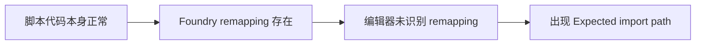
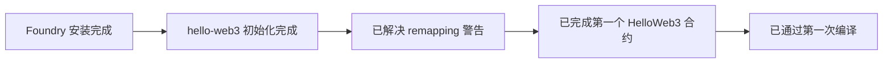

# Solidity101 学习笔记

## 学习方式

| 项目 | 内容 |
|---|---|
| 学习路线 | 按 `WTF Academy Solidity101` 顺序推进 |
| 开发环境 | 本地 `Foundry` |
| 学习习惯 | 一点点敲代码，边学边验证 |
| 学习模式 | 我负责监督、记录、提问，你负责动手 |

当前工具路线说明：

| 路线 | 当前状态 | 说明 |
|---|---|---|
| `Foundry` | 当前主线 | 用于 Solidity 学习、编译、部署、调用 |
| `Hardhat` | 暂未开始 | 后续如果学习，会单独区分记录 |

备注：
- 当前学习方案的正确名称是 `Foundry`，不是 `Fourage`。
- 后面如果切换到 `Hardhat`，笔记会明确分成两条工具路线，避免混淆。

## Git 结构笔记

### 为什么会有提交警告

原因：


所以外层仓库提交时会出现类似：
- `modified: hello-web3 (modified content)`
- `submodules` 相关提示

### 当前采用的解决方案

目标：
- 去掉 `hello-web3` 的独立 Git 仓库身份
- 去掉 `forge-std` 的 submodule 身份
- 让外层学习仓库统一管理代码和笔记

本次实际处理：

| 动作 | 结果 |
|---|---|
| 备份 `hello-web3/.git` | 已完成 |
| 备份 `hello-web3/.gitmodules` | 已完成 |
| 删除 `hello-web3/lib/forge-std/.git` 指针 | 已完成 |
| 外层仓库移除旧 gitlink | 已完成 |
| 外层仓库重新 `git add hello-web3` | 已完成 |

备份位置：

```text
/tmp/hello-web3-git-backups-20260402-094333
```

现在的结构：


以后新建 Foundry 学习项目时：
- 如果项目放进当前学习总仓库，建议去掉它自带的 `.git`
- 不要把 `lib/forge-std` 简单写进 `.gitignore`
- 关键是避免“外层仓库 + 内层仓库 + submodule”这种套娃结构

学习流程：


## 环境搭建笔记

### 1. Foundry 安装

结果：

| 项目 | 结果 |
|---|---|
| 安装方式 | `foundryup` |
| 验证命令 | `forge --version` |
| 当前版本 | `forge 1.5.1-stable` |

要点：
- `foundryup` 是 `Foundry` 的安装和升级工具。
- `forge` 是最常用的 Solidity 编译和测试命令。
- 现在本机已经具备 Solidity 本地学习环境。

### 2. 初始化第一个项目

执行命令：

```bash
forge init hello-web3
```

结果：

| 项目 | 结果 |
|---|---|
| 项目名 | `hello-web3` |
| 初始化状态 | 成功 |
| 默认内容 | `src`、`test`、`script`、`foundry.toml` |

目录作用速记：

| 目录/文件 | 作用 |
|---|---|
| `src/` | 放合约源码 |
| `test/` | 放测试 |
| `script/` | 放部署或交互脚本 |
| `foundry.toml` | 项目配置 |
| `lib/` | 依赖库 |

### 3. VS Code 导入警告排查

现象：

| 文件 | 提示 |
|---|---|
| `script/Counter.s.sol` | `Expected import path` |

原因：

| 原因 | 说明 |
|---|---|
| Foundry 使用 remapping | `forge-std/` 实际映射到 `lib/forge-std/src/` |
| VS Code 插件未立即识别 remapping | 所以对 `forge-std/Script.sol` 误报 |

排查结论：



解决方法：

```bash
cd hello-web3
forge remappings > remappings.txt
```

结果：

| 项目 | 结果 |
|---|---|
| `remappings.txt` | 已生成 |
| VS Code 导入警告 | 已消失 |

这一步学到的知识：
- `forge-std/Script.sol` 是 Foundry 的正常导入方式。
- `remappings.txt` 用来帮助编辑器理解依赖别名。
- 有些 Solidity 插件即使是最新版本，也可能需要项目显式提供 remapping 文件。

补充说明：
- 当前打开的 VS Code 工作区根目录是外层学习目录，不是 `hello-web3` 项目根目录。
- 当 Foundry 项目位于工作区子目录时，编辑器有时不会稳定识别 `foundry.toml` 和 `remappings.txt`。
- 这种情况下，可以在工作区补 `.vscode/settings.json`，手动告诉扩展依赖目录和 remapping。

当前工作区补充配置：

```json
{
  "solidity.packageDefaultDependenciesContractsDirectory": "src",
  "solidity.packageDefaultDependenciesDirectory": [
    "hello-web3/lib",
    "hello-web3/node_modules"
  ],
  "solidity.remappings": [
    "forge-std/=hello-web3/lib/forge-std/src/"
  ]
}
```

## 当前进度



## 第 1 章 HelloWeb3

### 当前实操结果

| 项目 | 状态 |
|---|---|
| 第一个最小合约 | 已完成 |
| 脚本引用同步 | 已完成 |
| `forge build` | 已通过 |

本章目前完成流程：


### 本章第一个合约

```solidity
// SPDX-License-Identifier: MIT
pragma solidity ^0.8.13;

contract HelloWeb3 {
    string public _string = "Hello Web3!";
}
```

### 这 3 行现在先记住

| 代码 | 含义 |
|---|---|
| `SPDX-License-Identifier: MIT` | 声明代码许可证 |
| `pragma solidity ^0.8.13;` | 指定 Solidity 编译器版本范围 |
| `string public _string = "Hello Web3!";` | 定义一个公开的字符串状态变量 |

### 本章检查题结果

| 问题 | 结果 |
|---|---|
| `SPDX-License-Identifier` 是干什么的？ | 回答正确，理解为代码使用许可证 |
| `pragma solidity ^0.8.13;` 表示什么？ | 回答正确，理解了 `>=0.8.13` 且 `<0.9.0` |
| `public` 有什么作用？ | 回答正确，知道会自动生成读取函数 |

结论：
- 第 `1` 章 `HelloWeb3` 已通过。
- 可以进入第 `2` 章 `Value Types`。

## 下一步

1. 开始第 `2` 章 `Value Types`。
2. 学习 `bool`、`int`、`uint`、`address`。
3. 亲手写一个值类型练习合约。

## 第 2 章 Value Types

### 当前实操结果

| 项目 | 状态 |
|---|---|
| `ValueTypes` 合约 | 已写完 |
| `forge build` | 已通过 |
| 编译警告 | 已清理 |

本章目前完成流程：


### 当前练习的 4 个值类型

| 类型 | 例子 | 说明 |
|---|---|---|
| `bool` | `true` | 布尔值，只有真和假 |
| `uint256` | `18` | 无符号整数，不能为负 |
| `int256` | `-1` | 有符号整数，可以为负 |
| `address` | `0x...dEaD` | 以太坊地址类型 |

### 本章检查题结果

| 问题 | 结果 |
|---|---|
| `uint256` 和 `int256` 最大区别是什么？ | 回答正确，知道一个无符号，一个可以表示负数 |
| 为什么 `age` 适合用 `uint256`？ | 回答正确，知道年龄不应为负数 |
| 为什么 `address` 不能直接用 `string` 代替？ | 方向对，但表述需要更精确 |

第 3 题更准确的说法：
- `address` 是 Solidity 的内建类型，专门表示 20 字节的以太坊地址。
- 它可以直接参与地址比较、转账、权限控制等链上操作。
- `string` 只是文本，不具备这些语义和类型安全。

结论：
- 第 `2` 章 `Value Types` 基本通过。
- 可以进入第 `3` 章 `Function`。

## 第 3 章 Function

### 当前实操结果

| 项目 | 状态 |
|---|---|
| `FunctionsDemo` 合约 | 已写完 |
| `forge build` | 已通过 |

本章目前完成流程：


### 当前练习的函数概念

| 代码 | 作用 |
|---|---|
| `function setNumber(uint256 newNumber) public` | 定义一个公开函数，并接收一个参数 |
| `number = newNumber;` | 修改链上状态变量 |
| `function addOne() public` | 定义一个无参数函数 |
| `number = number + 1;` | 让状态变量自增 |

### 本章检查题结果

| 问题 | 结果 |
|---|---|
| `newNumber` 是什么？ | 回答正确，是传入参数 |
| `setNumber` 和 `addOne` 的区别？ | 回答基本正确，一个有参数，一个无参数 |
| 为什么 `addOne()` 后 `number` 会变化？ | 方向对，但需要补充初始化概念 |

更准确的说明：
- `number` 是状态变量，初始值在合约里被设置为 `0`。
- 如果先不调用 `setNumber()`，直接调用 `addOne()`，那结果就是从 `0` 变成 `1`。
- 因为 `addOne()` 的逻辑是 `number = number + 1;`。

### 补充：怎么“使用”函数

只写出函数还不够，还要“部署合约并调用函数”。

最小使用流程：


后面会用 `anvil` + `cast` 练习：
- `anvil` 负责启动本地测试链
- `cast` 负责调用合约函数

### 本章实调用结果

| 步骤 | 结果 |
|---|---|
| 启动 `anvil` | 已完成 |
| 部署 `FunctionsDemo` | 已完成 |
| 合约地址 | `0x5FbDB2315678afecb367f032d93F642f64180aa3` |
| 初始 `number()` | `0` |
| 调用 `setNumber(7)` 后 | `7` |
| 调用 `addOne()` 后 | `8` |

调用闭环：

```mermaid
flowchart LR
A[anvil] --> B[forge create --broadcast]
B --> C[number() = 0]
C --> D[setNumber(7)]
D --> E[number() = 7]
E --> F[addOne()]
F --> G[number() = 8]
```

结论：
- 第 `3` 章 `Function` 已完成“写函数 + 编译 + 部署 + 调用”的完整闭环。
- 已经真正理解函数不是只写出来，还要被调用才会生效。

### 本章用到的命令

启动本地链：

```bash
anvil
```

部署合约：

```bash
forge create src/Counter.sol:FunctionsDemo \
  --rpc-url http://127.0.0.1:8545 \
  --private-key <ANVIL_PRIVATE_KEY> \
  --broadcast
```

读取链上状态：

```bash
cast call <CONTRACT_ADDRESS> "number()(uint256)" \
  --rpc-url http://127.0.0.1:8545
```

调用 `setNumber(7)`：

```bash
cast send <CONTRACT_ADDRESS> \
  "setNumber(uint256)" 7 \
  --rpc-url http://127.0.0.1:8545 \
  --private-key <ANVIL_PRIVATE_KEY>
```

调用 `addOne()`：

```bash
cast send <CONTRACT_ADDRESS> \
  "addOne()" \
  --rpc-url http://127.0.0.1:8545 \
  --private-key <ANVIL_PRIVATE_KEY>
```

这一步要记住：
- `cast call` 用来读，不改链上状态。
- `cast send` 用来写，会改链上状态。
