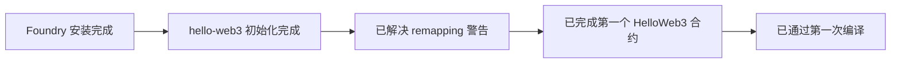

# Solidity101 学习笔记

## 学习方式

| 项目 | 内容 |
|---|---|
| 学习路线 | 按 `WTF Academy Solidity101` 顺序推进 |
| 开发环境 | 本地 `Foundry` |
| 学习习惯 | 一点点敲代码，边学边验证 |
| 学习模式 | 我负责监督、记录、提问，你负责动手 |

当前工具路线说明：

| 路线 | 当前状态 | 说明 |
|---|---|---|
| `Foundry` | 当前主线 | 用于 Solidity 学习、编译、部署、调用 |
| `Hardhat` | 暂未开始 | 后续如果学习，会单独区分记录 |

备注：
- 当前学习方案的正确名称是 `Foundry`，不是 `Fourage`。
- 后面如果切换到 `Hardhat`，笔记会明确分成两条工具路线，避免混淆。

## Git 结构笔记

### 为什么会有提交警告

原因：


所以外层仓库提交时会出现类似：
- `modified: hello-web3 (modified content)`
- `submodules` 相关提示

### 当前采用的解决方案

目标：
- 去掉 `hello-web3` 的独立 Git 仓库身份
- 去掉 `forge-std` 的 submodule 身份
- 让外层学习仓库统一管理代码和笔记

本次实际处理：

| 动作 | 结果 |
|---|---|
| 备份 `hello-web3/.git` | 已完成 |
| 备份 `hello-web3/.gitmodules` | 已完成 |
| 删除 `hello-web3/lib/forge-std/.git` 指针 | 已完成 |
| 外层仓库移除旧 gitlink | 已完成 |
| 外层仓库重新 `git add hello-web3` | 已完成 |

备份位置：

```text
/tmp/hello-web3-git-backups-20260402-094333
```

现在的结构：


以后新建 Foundry 学习项目时：
- 如果项目放进当前学习总仓库，建议去掉它自带的 `.git`
- 不要把 `lib/forge-std` 简单写进 `.gitignore`
- 关键是避免“外层仓库 + 内层仓库 + submodule”这种套娃结构

学习流程：


## 环境搭建笔记

### 1. Foundry 安装

结果：

| 项目 | 结果 |
|---|---|
| 安装方式 | `foundryup` |
| 验证命令 | `forge --version` |
| 当前版本 | `forge 1.5.1-stable` |

要点：
- `foundryup` 是 `Foundry` 的安装和升级工具。
- `forge` 是最常用的 Solidity 编译和测试命令。
- 现在本机已经具备 Solidity 本地学习环境。

### 2. 初始化第一个项目

执行命令：

```bash
forge init hello-web3
```

结果：

| 项目 | 结果 |
|---|---|
| 项目名 | `hello-web3` |
| 初始化状态 | 成功 |
| 默认内容 | `src`、`test`、`script`、`foundry.toml` |

目录作用速记：

| 目录/文件 | 作用 |
|---|---|
| `src/` | 放合约源码 |
| `test/` | 放测试 |
| `script/` | 放部署或交互脚本 |
| `foundry.toml` | 项目配置 |
| `lib/` | 依赖库 |

### 3. VS Code 导入警告排查

现象：

| 文件 | 提示 |
|---|---|
| `script/Counter.s.sol` | `Expected import path` |

原因：

| 原因 | 说明 |
|---|---|
| Foundry 使用 remapping | `forge-std/` 实际映射到 `lib/forge-std/src/` |
| VS Code 插件未立即识别 remapping | 所以对 `forge-std/Script.sol` 误报 |

排查结论：


解决方法：

```bash
cd hello-web3
forge remappings > remappings.txt
```

结果：

| 项目 | 结果 |
|---|---|
| `remappings.txt` | 已生成 |
| VS Code 导入警告 | 已消失 |

这一步学到的知识：
- `forge-std/Script.sol` 是 Foundry 的正常导入方式。
- `remappings.txt` 用来帮助编辑器理解依赖别名。
- 有些 Solidity 插件即使是最新版本，也可能需要项目显式提供 remapping 文件。

补充说明：
- 当前打开的 VS Code 工作区根目录是外层学习目录，不是 `hello-web3` 项目根目录。
- 当 Foundry 项目位于工作区子目录时，编辑器有时不会稳定识别 `foundry.toml` 和 `remappings.txt`。
- 这种情况下，可以在工作区补 `.vscode/settings.json`，手动告诉扩展依赖目录和 remapping。

当前工作区补充配置：

```json
{
  "solidity.packageDefaultDependenciesContractsDirectory": "src",
  "solidity.packageDefaultDependenciesDirectory": [
    "hello-web3/lib",
    "hello-web3/node_modules"
  ],
  "solidity.remappings": [
    "forge-std/=hello-web3/lib/forge-std/src/"
  ]
}
```

## 当前进度



## 第 1 章 HelloWeb3

### 当前实操结果

| 项目 | 状态 |
|---|---|
| 第一个最小合约 | 已完成 |
| 脚本引用同步 | 已完成 |
| `forge build` | 已通过 |

本章目前完成流程：


### 本章第一个合约

```solidity
// SPDX-License-Identifier: MIT
pragma solidity ^0.8.13;

contract HelloWeb3 {
    string public _string = "Hello Web3!";
}
```

### 这 3 行现在先记住

| 代码 | 含义 |
|---|---|
| `SPDX-License-Identifier: MIT` | 声明代码许可证 |
| `pragma solidity ^0.8.13;` | 指定 Solidity 编译器版本范围 |
| `string public _string = "Hello Web3!";` | 定义一个公开的字符串状态变量 |

### 本章检查题结果

| 问题 | 结果 |
|---|---|
| `SPDX-License-Identifier` 是干什么的？ | 回答正确，理解为代码使用许可证 |
| `pragma solidity ^0.8.13;` 表示什么？ | 回答正确，理解了 `>=0.8.13` 且 `<0.9.0` |
| `public` 有什么作用？ | 回答正确，知道会自动生成读取函数 |

结论：
- 第 `1` 章 `HelloWeb3` 已通过。
- 可以进入第 `2` 章 `Value Types`。

## 下一步

1. 开始第 `2` 章 `Value Types`。
2. 学习 `bool`、`int`、`uint`、`address`。
3. 亲手写一个值类型练习合约。

## 第 2 章 Value Types

### 当前实操结果

| 项目 | 状态 |
|---|---|
| `ValueTypes` 合约 | 已写完 |
| `forge build` | 已通过 |
| 编译警告 | 已清理 |

本章目前完成流程：


### 当前练习的 4 个值类型

| 类型 | 例子 | 说明 |
|---|---|---|
| `bool` | `true` | 布尔值，只有真和假 |
| `uint256` | `18` | 无符号整数，不能为负 |
| `int256` | `-1` | 有符号整数，可以为负 |
| `address` | `0x...dEaD` | 以太坊地址类型 |

### 本章检查题结果

| 问题 | 结果 |
|---|---|
| `uint256` 和 `int256` 最大区别是什么？ | 回答正确，知道一个无符号，一个可以表示负数 |
| 为什么 `age` 适合用 `uint256`？ | 回答正确，知道年龄不应为负数 |
| 为什么 `address` 不能直接用 `string` 代替？ | 方向对，但表述需要更精确 |

第 3 题更准确的说法：
- `address` 是 Solidity 的内建类型，专门表示 20 字节的以太坊地址。
- 它可以直接参与地址比较、转账、权限控制等链上操作。
- `string` 只是文本，不具备这些语义和类型安全。

结论：
- 第 `2` 章 `Value Types` 基本通过。
- 可以进入第 `3` 章 `Function`。

## 第 3 章 Function

### 当前实操结果

| 项目 | 状态 |
|---|---|
| `FunctionsDemo` 合约 | 已写完 |
| `forge build` | 已通过 |

本章目前完成流程：


### 当前练习的函数概念

| 代码 | 作用 |
|---|---|
| `function setNumber(uint256 newNumber) public` | 定义一个公开函数，并接收一个参数 |
| `number = newNumber;` | 修改链上状态变量 |
| `function addOne() public` | 定义一个无参数函数 |
| `number = number + 1;` | 让状态变量自增 |

### 本章检查题结果

| 问题 | 结果 |
|---|---|
| `newNumber` 是什么？ | 回答正确，是传入参数 |
| `setNumber` 和 `addOne` 的区别？ | 回答基本正确，一个有参数，一个无参数 |
| 为什么 `addOne()` 后 `number` 会变化？ | 方向对，但需要补充初始化概念 |

更准确的说明：
- `number` 是状态变量，初始值在合约里被设置为 `0`。
- 如果先不调用 `setNumber()`，直接调用 `addOne()`，那结果就是从 `0` 变成 `1`。
- 因为 `addOne()` 的逻辑是 `number = number + 1;`。

### 补充：怎么“使用”函数

只写出函数还不够，还要“部署合约并调用函数”。

最小使用流程：


后面会用 `anvil` + `cast` 练习：
- `anvil` 负责启动本地测试链
- `cast` 负责调用合约函数

### 本章实调用结果

| 步骤 | 结果 |
|---|---|
| 启动 `anvil` | 已完成 |
| 部署 `FunctionsDemo` | 已完成 |
| 合约地址 | `0x5FbDB2315678afecb367f032d93F642f64180aa3` |
| 初始 `number()` | `0` |
| 调用 `setNumber(7)` 后 | `7` |
| 调用 `addOne()` 后 | `8` |

调用闭环：

```mermaid
flowchart LR
A[anvil] --> B[forge create --broadcast]
B --> C[number() = 0]
C --> D[setNumber(7)]
D --> E[number() = 7]
E --> F[addOne()]
F --> G[number() = 8]
```

结论：
- 第 `3` 章 `Function` 已完成“写函数 + 编译 + 部署 + 调用”的完整闭环。
- 已经真正理解函数不是只写出来，还要被调用才会生效。

### 本章用到的命令

启动本地链：

```bash
anvil
```

部署合约：

```bash
forge create src/Counter.sol:FunctionsDemo \
  --rpc-url http://127.0.0.1:8545 \
  --private-key <ANVIL_PRIVATE_KEY> \
  --broadcast
```

读取链上状态：

```bash
cast call <CONTRACT_ADDRESS> "number()(uint256)" \
  --rpc-url http://127.0.0.1:8545
```

调用 `setNumber(7)`：

```bash
cast send <CONTRACT_ADDRESS> \
  "setNumber(uint256)" 7 \
  --rpc-url http://127.0.0.1:8545 \
  --private-key <ANVIL_PRIVATE_KEY>
```

调用 `addOne()`：

```bash
cast send <CONTRACT_ADDRESS> \
  "addOne()" \
  --rpc-url http://127.0.0.1:8545 \
  --private-key <ANVIL_PRIVATE_KEY>
```

这一步要记住：
- `cast call` 用来读，不改链上状态。
- `cast send` 用来写，会改链上状态。

## ABI 与 cast 命令补充笔记

### ABI 是什么

| 缩写 | 全名 |
|---|---|
| `ABI` | `Application Binary Interface` |

一句话理解：
- ABI 是外部程序如何调用合约、以及如何解码返回结果的接口说明书。

### cast 里的函数签名模板

```text
函数名(参数类型1,参数类型2,...)(返回类型1,返回类型2,...)
```

例子：

| 写法 | 含义 |
|---|---|
| `"returnOne()(uint256)"` | 无参数，返回一个 `uint256` |
| `"returnMany()(uint256,bool,uint256)"` | 无参数，返回三个值 |
| `"numbers(uint256)(uint256)"` | 传一个 `uint256`，返回一个 `uint256` |
| `"sum(uint256[])(uint256)"` | 传一个 `uint256[]`，返回一个 `uint256` |

### 为什么不能只写函数名

原因：
- `cast` 需要知道参数类型，才能按 ABI 编码。
- `cast` 需要知道返回类型，才能按 ABI 解码。
- Solidity 支持函数重载，同名函数可能不止一个。

### cast call 的流程


一句话结论：
- `cast` 里的类型声明，本质上是在使用 ABI。

## 第 4 章 Function Output

### 当前实操结果

| 项目 | 状态 |
|---|---|
| `FunctionOutputs` 合约 | 已完成 |
| `forge build` | 已通过 |
| `returnOne()` | 已验证 |
| `returnMany()` | 已验证 |
| 解构赋值 | 已完成 |

### 本章关键点

| 关键词 | 含义 |
|---|---|
| `returns` | 声明返回值类型 |
| `return` | 实际返回数据 |
| `pure` | 不读取也不修改链上状态 |
| 多返回值 | 一次返回多个值 |
| 解构赋值 | 一次接收多个返回值 |

### 命令行验证结果

| 调用 | 结果 |
|---|---|
| `returnOne()` | `1` |
| `returnMany()` | `1 true 2` |

结论：
- Solidity 里的 `return (1, true, 2)` 本质是 tuple。
- `cast call` 会把 tuple 解码成命令行里的多个值。

## 第 5 章 Data Storage and Scope

### 当前实操结果

| 项目 | 状态 |
|---|---|
| `DataLocations` 合约 | 已完成 |
| `forge build` | 已通过 |
| `storage/memory/calldata` | 已理解 |
| `cast` 调用验证 | 已完成 |

### 三种数据位置

| 类型 | 含义 |
|---|---|
| `storage` | 链上原数据 |
| `memory` | 临时副本 |
| `calldata` | 外部传入的只读参数 |

### 命令行验证结果

| 调用 | 结果 |
|---|---|
| 初始 `numbers(0)` | `1` |
| `changeWithStorage()` 后 | `100` |
| `changeWithMemory()` | 只返回修改后的副本 |
| 再读 `numbers(0)` | 仍是链上值，不会变成 `999` |
| `sum([4,5,6])` | `15` |

结论：
- `storage` 是原件。
- `memory` 是副本。
- `calldata` 是外部输入的只读数据。

## 第 6 章 Array & Struct

### 当前实操结果

| 项目 | 状态 |
|---|---|
| `ArrayAndStruct` 合约 | 已完成 |
| `forge build` | 已通过 |
| 定长数组 | 已完成 |
| 动态数组 | 已完成 |
| `struct Student` | 已完成 |
| `students` 结构体数组 | 已完成 |
| `cast` 调用验证 | 已完成 |

### 本章关键点

| 概念 | 含义 |
|---|---|
| `uint256[3]` | 定长数组，长度固定 |
| `uint256[]` | 动态数组，长度可变 |
| `struct Student` | 用一条记录表示一个学生 |
| `Student[] students` | 用数组保存多条学生记录 |
| `push()` | 往动态数组末尾追加元素 |

### 本章代码理解

| 代码 | 作用 |
|---|---|
| `fixedNumbers` | 练习定长数组 |
| `dynamicNumbers` | 练习动态数组 |
| `getDynamicNumbers()` | 一次读取整个动态数组 |
| `pushDynamicNumber()` | 往动态数组追加数字 |
| `addStudent()` | 新增一个学生 |
| `getStudent()` | 读取某个学生 |

### 数据位置补充

| 场景 | 说明 |
|---|---|
| 状态变量 `dynamicNumbers` | 默认就在 `storage` |
| `return dynamicNumbers;` | 返回时会复制成 `memory` 副本 |
| `returns (string memory, uint256, address)` | 只有 `string` 这类引用类型需要标 `memory` |
| `uint256` / `address` | 值类型，不写 `memory` |

### 易错点

| 易错说法 | 正确说法 |
|---|---|
| `dynamicNumbers` 在链上是因为它写了 `public` | `dynamicNumbers` 在链上是因为它是状态变量；状态变量默认在 `storage` |

### 命令行验证结果

| 调用 | 结果 |
|---|---|
| `fixedNumbers(0)` | `1` |
| `dynamicNumbers(0)` | `10` |
| `dynamicNumbers(1)` | `20` |
| `getDynamicNumbers()` 初始值 | `[10, 20]` |
| `pushDynamicNumber(30)` 后 | `[10, 20, 30]` |
| `addStudent("Alice", 95, <address>)` 后再读 `getStudent(0)` | `Alice 95 <address>` |

### cast 命令补充理解

| 写法 | 含义 |
|---|---|
| `"dynamicNumbers(uint256)(uint256)" 1` | 读 `dynamicNumbers[1]` |
| `"getStudent(uint256)(string,uint256,address)" 0` | 读第 `0` 个学生 |

一句话结论：
- `cast` 里引号内写 ABI 签名，引号外写实际参数值。

结论：
- 数组适合保存很多个同类型数据。
- 结构体适合表示一条复杂记录。
- 数组和结构体组合起来，就能表示“很多条记录”。

## 第 7 章 Mapping

### 当前实操结果

| 项目 | 状态 |
|---|---|
| `MappingDemo` 合约 | 已完成 |
| `forge build` | 已通过 |
| `mapping(address => uint256)` | 已完成 |
| `setBalance()` | 已完成 |
| `getBalance()` | 已完成 |
| `cast` 调用验证 | 已完成 |

### 本章关键点

| 概念 | 含义 |
|---|---|
| `mapping(key => value)` | 键值表 |
| `mapping(address => uint256)` | 地址映射到数字 |
| `balances[user] = amount` | 给某个 key 写值 |
| `balances[user]` | 按 key 读值 |

### 命令行验证结果

| 调用 | 结果 |
|---|---|
| 初次读取未写入地址 | `0` |
| `setBalance(address, 123)` | 交易成功 |
| 再次读取同一地址 | `123` |

### 默认值说明

| value 类型 | 默认值 |
|---|---|
| `uint256` | `0` |
| `bool` | `false` |
| `address` | `0x0000000000000000000000000000000000000000` |

说明：
- `mapping` 没有“报 key 不存在”这一说，而是直接返回 value 类型的默认值。
- 所以默认值有没有意义，取决于你的业务语义，不是 `mapping` 自己替你区分“真的写了默认值”还是“从没写过”。
- 如果业务上必须区分“没写过”和“写过但值刚好等于默认值”，通常要额外加一个标记，比如 `mapping(address => bool) hasValue`。

### 易错点

| 易错说法 | 正确说法 |
|---|---|
| `getBalance()` 比自动 getter 更安全，因为能防止别人读取 | 链上公开状态本来就是可读的；当前它们主要差别是可扩展性和可读性 |

结论：
- `mapping` 很适合余额、权限、授权、拥有者关系这类按 key 查询的场景。
- `mapping` 不能直接遍历，也不能直接知道“有多少项”。

## 第 8 章 Initial Value

### 当前实操结果

| 项目 | 状态 |
|---|---|
| `InitialValueDemo` 合约 | 已完成 |
| `forge build` | 已通过 |
| 基础类型默认值 | 已完成 |
| 数组默认值 | 已完成 |
| 结构体默认值 | 已完成 |
| `delete` 基础练习 | 已完成 |

### 本章关键点

| 概念 | 含义 |
|---|---|
| 默认值 | 变量未手动赋值时的初始状态 |
| `delete` | 把变量重置为该类型默认值 |
| 零地址 | `address` 的默认值 |

### 默认值速记

| 类型 | 默认值 |
|---|---|
| `bool` | `false` |
| `uint256` | `0` |
| `int256` | `0` |
| `address` | `0x0000000000000000000000000000000000000000` |
| `string` | `""` |
| 动态数组 | `[]` |

### 结构体默认值

| 字段 | 默认值 |
|---|---|
| `person.name` | `""` |
| `person.age` | `0` |

### delete 行为

| 写法 | 结果 |
|---|---|
| `delete amount` | `0` |
| `delete flag` | `false` |
| `delete owner` | 零地址 |
| `delete name` | `""` |
| `delete numbers` | `[]` |
| `delete person` | 每个字段重置默认值 |
| `delete balances` | 不允许 |
| `delete balances[user]` | 可以，把该 key 的 value 重置默认值 |

### 易错点

| 易错说法 | 正确说法 |
|---|---|
| `delete` 就是把变量删除掉 | Solidity 里的 `delete` 是重置为默认值，不是删除变量定义 |
| `mapping` 也能像别的变量一样整体 `delete` | `mapping` 不能整体 `delete`，只能 `delete balances[user]` |

结论：
- 默认值是 Solidity 的底层规则，很多读取行为都建立在它上面。
- `delete` 更像统一的“reset”操作，不是 JavaScript 语义里的“删属性”。

## 第 9 章 Constant and Immutable

### 当前实操结果

| 项目 | 状态 |
|---|---|
| `ConstantDemo` 合约 | 已完成 |
| `forge build` | 已通过 |
| `constant` 练习 | 已完成 |
| `immutable` 练习 | 已完成 |
| 本地部署 | 已完成 |
| `cast` 调用验证 | 已完成 |

### 本章关键点

| 关键词 | 含义 |
|---|---|
| `constant` | 声明时就必须赋值，之后不能改 |
| `immutable` | 构造阶段赋值一次，之后不能改 |
| `msg.sender` | 当前调用者；在构造函数里通常就是部署者 |

### 代码理解

| 代码 | 作用 |
|---|---|
| `uint256 public constant MY_NUMBER = 123;` | 编译时固定常量 |
| `address public immutable owner;` | 部署时确定拥有者 |
| `owner = msg.sender;` | 把部署者地址写进 `owner` |

### 命令行验证结果

| 调用 | 结果 |
|---|---|
| `MY_NUMBER()` | `123` |
| `owner()` | `0xf39Fd6e51aad88F6F4ce6aB8827279cffFb92266` |

### 易错点

| 易错说法 | 正确说法 |
|---|---|
| `public` 和 `constant` 是一个维度的东西 | `public` 是可见性；`constant` / `immutable` 是可变性 |
| `immutable` 是部署后还能改一次 | `immutable` 只能在构造阶段赋值，部署完成后就不能改 |

### 补充理解

| 对比 | 更像什么 |
|---|---|
| `constant` | 写死在代码里的常量 |
| `immutable` | 部署时注入的只读配置 |
| 普通状态变量 | 部署后还能被函数修改的链上状态 |

结论：
- `constant` 和 `immutable` 都是“以后不能改”的变量。
- 区别在于：`constant` 在写代码时确定，`immutable` 在部署时确定。

## 第 10 章 Control Flow

### 当前实操结果

| 项目 | 状态 |
|---|---|
| `ControlFlowDemo` 合约 | 已完成 |
| `forge build` | 已通过 |
| `if / else` 练习 | 已完成 |
| `for` 循环练习 | 已完成 |
| 本地部署 | 已完成 |
| `cast` 调用验证 | 已完成 |

### 本章关键点

| 关键词 | 含义 |
|---|---|
| `if / else` | 条件判断 |
| 三元运算符 | 简写条件表达式 |
| `for` | 重复执行一段逻辑 |

### 命令行验证结果

| 调用 | 结果 |
|---|---|
| `checkNumber(11)` | `big` |
| `checkNumber(10)` | `small` |
| `sum(5)` | `15` |

### 检查题纠正

| 题目 | 正确说法 |
|---|---|
| `x = 10` 为什么返回 `small` | 因为条件是严格大于 `10`，`10 > 10` 为假 |
| 循环什么时候结束 | 当 `i <= n` 不再成立时结束，也就是 `i > n` 时结束 |
| 为什么链上循环要小心 | 循环越大，gas 消耗越高；过大可能导致交易失败 |

### 易错点

| 易错说法 | 正确说法 |
|---|---|
| `for` 只要能写出来就行 | 链上循环要关注 gas 成本和边界条件 |
| `n > i` 时循环结束 | 当前代码里是 `i <= n` 为继续条件，所以 `i > n` 时结束 |

结论：
- 控制流本质就是“条件判断 + 重复执行”。
- 在 Solidity 里，循环除了逻辑正确，还要额外考虑 gas 成本。

## 第 11 章 constructor and modifier

### 当前实操结果

| 项目 | 状态 |
|---|---|
| `ConstructorModifierDemo` 合约 | 已完成 |
| `forge build` | 已通过 |
| `constructor` 练习 | 已完成 |
| `modifier` 练习 | 已完成 |
| 本地部署 | 已完成 |
| `cast` 调用验证 | 已完成 |

### 本章关键点

| 关键词 | 含义 |
|---|---|
| `constructor` | 合约部署时自动执行一次 |
| `modifier` | 给函数加统一检查逻辑 |
| `onlyOwner` | 常见权限控制模式 |
| `_` | 原函数正文真正执行的位置 |

### 代码理解

| 代码 | 作用 |
|---|---|
| `owner = msg.sender;` | 在部署时记录 owner |
| `modifier onlyOwner()` | 限制只有 owner 能通过 |
| `require(msg.sender == owner, "Not the owner");` | 不满足条件就回退 |
| `function setNumber(...) public onlyOwner` | 只有 owner 能改 `number` |

### 风格补充

| 写法 | 含义 |
|---|---|
| `_onlyOwner()` | 只是命名习惯，表示内部辅助函数 |
| `internal` | 才是真正决定“只能合约内部用”的可见性 |

### 命令行验证结果

| 调用 | 结果 |
|---|---|
| `owner()` | `0xf39Fd6e51aad88F6F4ce6aB8827279cffFb92266` |
| owner 调 `setNumber(7)` | 成功 |
| 再读 `number()` | `7` |
| 非 owner 调 `setNumber(99)` | 回退：`Not the owner` |

### 易错点

| 易错说法 | 正确说法 |
|---|---|
| `constructor` 和普通函数差不多，只是名字特殊 | `constructor` 只在部署时自动执行一次 |
| `_onlyOwner` 前面的 `_` 就代表私有 | `_` 只是命名习惯；真正限制可见性的是 `internal/private` |
| `modifier` 是在函数后执行 | 当前 `onlyOwner` 是前置检查，因为 `_` 写在检查后面 |

结论：
- `constructor` 负责“部署时初始化”。
- `modifier` 负责“调用前先过门禁”。
- `onlyOwner` 是最经典的权限控制模板。

## 第 12 章 Events

### 当前实操结果

| 项目 | 状态 |
|---|---|
| `EventsDemo` 合约 | 已完成 |
| `forge build` | 已通过 |
| `event` 定义 | 已完成 |
| `emit` 练习 | 已完成 |
| 本地部署 | 已完成 |
| `cast` 调用验证 | 已完成 |

### 本章关键点

| 关键词 | 含义 |
|---|---|
| `event` | 定义链上日志格式 |
| `emit` | 发出一条事件日志 |
| `logs` | 交易回执里的事件记录 |

### 代码理解

| 代码 | 作用 |
|---|---|
| `event NumberChanged(address caller, uint256 newNumber);` | 定义事件结构 |
| `emit NumberChanged(msg.sender, newNumber);` | 记录谁改了什么值 |
| `number = newNumber;` | 修改链上状态 |

### 命令行验证结果

| 调用 | 结果 |
|---|---|
| `setNumber(42)` | 交易成功 |
| 交易回执 `logs` | 不为空 |
| `number()` | `42` |

### 前端视角理解

| 链上事件 | 类比 |
|---|---|
| `emit event` | 结构化日志 |
| 前端监听事件 | 通过 RPC / 库 / 索引器读取日志 |

说明：
- `emit` 本身不难，真正复杂的是前端如何稳定订阅、查询和处理事件。
- 事件里常常会带上 `msg.sender`，因为链上日志会被很多外部系统消费，必须说明“谁触发了这次动作”。

### 易错点

| 易错说法 | 正确说法 |
|---|---|
| 事件只是给当前前端页面自己用的 | 事件是链上日志，区块浏览器、前端、索引器都能消费 |
| 状态改了就够了，不需要事件 | 事件对前端同步、历史追踪和异步监听很重要 |

结论：
- `event` 是 Solidity 给链下世界看的“结构化日志”。
- 状态变量负责“当前状态”，事件更适合表达“刚刚发生了什么”。

## 第 13 章 Inheritance

### 当前实操结果

| 项目 | 状态 |
|---|---|
| `InheritanceDemo` 合约 | 已完成 |
| `forge build` | 已通过 |
| `Parent` / `Child` 练习 | 已完成 |
| 本地部署 | 已完成 |
| `cast` 调用验证 | 已完成 |

### 本章关键点

| 关键词 | 含义 |
|---|---|
| `contract Child is Parent` | 子合约继承父合约 |
| 继承 | 复用父合约的变量和函数 |
| 子合约扩展 | 在继承基础上再加自己的能力 |

### 代码理解

| 代码 | 作用 |
|---|---|
| `uint256 public number = 100;` | 父合约定义初始状态 |
| `getNumber()` | 父合约提供读取函数 |
| `Child is Parent` | 子合约继承父合约能力 |
| `setNumber()` | 子合约新增修改能力 |

### 命令行验证结果

| 调用 | 结果 |
|---|---|
| 初始 `number()` | `100` |
| 初始 `getNumber()` | `100` |
| `setNumber(200)` | 成功 |
| 再读 `number()` | `200` |

### 易错点

| 易错说法 | 正确说法 |
|---|---|
| `Child` 没写 `getNumber()` 就不能调用 | 继承后可以直接使用父合约公开/可继承的函数 |
| 只要父合约有变量，子合约一定都能直接访问 | 还要看可见性；`private` 变量不能被子合约直接访问 |

### 阅读体感补充

| 现象 | 说明 |
|---|---|
| 继承能减少重复代码 | 这是它最大的好处 |
| 继承层级多了会增加阅读成本 | 这也是很多工程里要谨慎使用继承的原因 |

结论：
- 继承的核心价值是复用通用逻辑。
- 继承虽然省代码，但层级一深，源码阅读难度会明显上升。

## 第 14 章 Abstract and Interface

### 当前实操结果

| 项目 | 状态 |
|---|---|
| `InterfaceDemo` 合约 | 已完成 |
| `forge build` | 已通过 |
| `interface ICounter` | 已完成 |
| `Counter is ICounter` | 已完成 |
| 本地部署 | 已完成 |
| `cast` 调用验证 | 已完成 |

### 本章关键点

| 关键词 | 含义 |
|---|---|
| `interface` | 只定义规则，不写具体实现 |
| `is` | 表示实现接口或继承父合约 |
| `external` | 接口里常见的函数可见性，强调给外部调用 |

### 代码理解

| 代码 | 作用 |
|---|---|
| `interface ICounter` | 约定必须有 `getNumber()` |
| `function getNumber() external view returns (uint256);` | 只定义签名，不写函数体 |
| `contract Counter is ICounter` | 具体实现这份接口规则 |
| `uint256 public number = 123;` | 提供实际状态 |

### 命令行验证结果

| 调用 | 结果 |
|---|---|
| `number()` | `123` |
| `getNumber()` | `123` |

### 发散问题补充

| 问题 | 结论 |
|---|---|
| Solidity 的 `interface` 里有没有像 Java 默认方法那样的实现 | 没有；接口只写声明，不写实现 |
| `interface` 里能不能定义普通状态变量 | 不能按普通合约那样定义状态变量；接口主要描述外部函数 |

### 易错点

| 易错说法 | 正确说法 |
|---|---|
| `interface` 只是另一个普通合约写法 | 接口只负责约定规则，不负责实现逻辑 |
| `Counter is ICounter` 只是语法装饰 | 这表示 `Counter` 承诺要实现接口要求的函数 |

结论：
- 接口的核心价值是“统一规则”。
- 这样不同合约只要实现同一接口，外部调用方就能用一致的函数签名去交互。

## 第 15 章 Errors

### 当前实操结果

| 项目 | 状态 |
|---|---|
| `ErrorsDemo` 合约 | 已完成 |
| `forge build` | 已通过 |
| `require` 练习 | 已完成 |
| `assert` 练习 | 已完成 |
| 自定义 `error` 练习 | 已完成 |
| 本地部署 | 已完成 |
| `cast` 调用验证 | 已完成 |

### 本章关键点

| 关键词 | 含义 |
|---|---|
| `require` | 检查外部输入、权限、前置条件 |
| `assert` | 检查内部断言和不变量 |
| `error` | 自定义错误类型，结构化且通常更省 gas |
| `revert` | 主动回退并返回错误 |

### 代码理解

| 代码 | 作用 |
|---|---|
| `require(newNumber > 0, "...")` | 最小前置校验 |
| `assert(number > 0)` | 检查内部结果没违背预期 |
| `error NotPositive(uint256 newNumber);` | 定义自定义错误类型 |
| `revert NotPositive(newNumber);` | 按自定义错误格式回退 |

### 命令行验证结果

| 调用 | 结果 |
|---|---|
| `setNumber(5)` | 成功 |
| `number()` | `5` |
| 旧版 `setNumber(0)` | 回退：`Number must be greater than 0` |
| 重新部署新版后 `setNumber(0)` | 回退：`NotPositive(0)` |

### 关键区分

| 关键词 | 更像什么 |
|---|---|
| `event` | 结构化日志 |
| `error` | 结构化异常 |

### 易错点

| 易错说法 | 正确说法 |
|---|---|
| `assert` 和 `require` 没区别 | `require` 主要挡非法输入；`assert` 主要查内部不变量 |
| 改完本地源码再 `forge build` 就能影响旧合约地址 | 链上旧合约不会变；改了逻辑后必须重新部署 |
| 自定义 `error` 像事件 | 它不是日志，不进 `logs`，而是回退时返回的错误数据 |

结论：
- `require` 是最常见的前置校验。
- `assert` 更适合检查“理论上绝不该被破坏”的内部条件。
- 自定义 `error` 是更结构化的失败表达方式。
