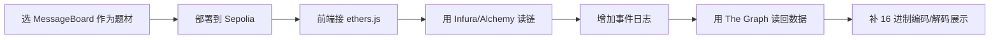

# 老师作业记录

## 原始作业

时间：`4月4号`

原文整理：

1. 做一个完整的界面，数据上链分为 `2` 种方式。
2. 寻找 `Sepolia` 水龙头，拿测试币。
3. 最好在测试网完成部署，并在 `https://sepolia.etherscan.io/` 开源合约；老师同时提到 `Hardhat`。
4. 对 `16` 进制数据有一个自己的加密和解密方式。
5. 通过 `Ether.js` 完成链上数据读取。
6. 使用 `Infura` 或 `Alchemy` 读取链上数据。
7. 了解 `The Graph`，完成链上数据读取 demo，要求使用“日志方式触发”。
8. 写一个合约专门把链上数据以日志形式写出去，并部署到测试链。
9. 使用 `The Graph` 把数据读回来。
10. 选修：通过转 `U` 的形式，读取 `USDT` 合约地址和链上 `HASH/ID` 数据。
11. 有精力的同学可以把 `Solana` 版本也做了。

老师给的选修地址记录：

```text
0xaA8E23Fb1079EA71e0a56F48a2aA51851D8433D0
```

## 我的理解

这份作业本质上不是“再写一个 Solidity 合约”这么简单，而是一个最小全栈 Web3 作业。

它主要考 4 件事：

1. 合约能不能部署到 `Sepolia`。
2. 前端能不能通过 `ethers.js` 把链上数据读出来、写进去。
3. 事件日志能不能被前端或 `The Graph` 消费。
4. 你能不能把“本地 demo”升级成“测试网可演示作品”。

## 作业拆解

| 模块 | 要求 | 我的判断 |
|---|---|---|
| 前端页面 | 做一个完整界面 | 必做 |
| `Sepolia` 水龙头 | 拿测试币 | 必做 |
| 测试网部署 + 合约开源 | 上链并验证源码 | 必做 |
| `ethers.js` 读链 | 前端读取合约数据 | 必做 |
| `Infura/Alchemy` | RPC 提供商 | 必做 |
| `The Graph` | 用日志索引并读回数据 | 必做 |
| 16 进制加解密 | 做一个自定义展示或编码方案 | 建议做最小版 |
| `USDT` 读链 | 转 `U` 并读地址/HASH/ID | 选修 |
| `Solana` | 额外扩展 | 选修 |

## 我对作业方向的判断

### 不建议一上来做太大

虽然我们已经学到了 `DES / Proxy / UUPS / Multisig`，但这份作业最稳的落地方式，不是直接做完整 `DES` 前端，而是先做一个最小全栈项目。

### 最推荐选题

我最推荐把之前做过的 `MessageBoard` 升级成老师作业版本。

原因：

1. 前端页面容易做完整。
2. 写链和读链都直观。
3. 事件日志天然适合接 `The Graph`。
4. 在 `Sepolia` 上演示成本低。
5. 比 `DES` 前端轻很多，更适合先交作业。

## 推荐交付路线



## 如果想做更贴近主线的版本

也可以把 `MinimalDESDemo` 做成前端页面，但这会更重。

| 方案 | 难度 | 适合度 |
|---|---|---|
| `MessageBoard` 作业版 | 低 | 最适合先交作业 |
| `MinimalDESDemo` 前端版 | 中 | 更贴近当前学习主线 |
| 完整 `DES` 测试网版 | 高 | 现阶段不建议直接冲 |

## 当前建议

当前最稳的策略是：

1. 先做一个 `MessageBoard` 的测试网全栈作业版。
2. 把 `ethers.js / Infura(or Alchemy) / The Graph / 合约开源` 这条链路跑通。
3. 作业交稳后，再考虑把 `MinimalDESDemo` 升级成更像真实协议的版本。

## 下次如果继续做作业

最自然的下一步顺序：

1. 明确最终选题：`MessageBoard` 还是 `MinimalDESDemo`。
2. 梳理前端页面字段和按钮。
3. 申请 `Sepolia` 测试币。
4. 选一个 RPC：`Infura` 或 `Alchemy`。
5. 部署合约并验证源码。
6. 接前端读写链。
7. 接 `The Graph`。
